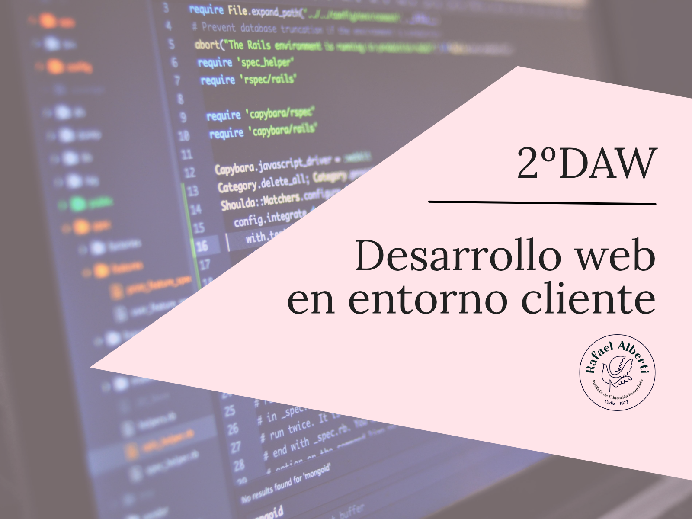

# Desarrollo web en entorno cliente

  

Material didáctico del módulo Desarrollo web en entorno cliente del CFGS Desarrollo web en entorno cliente del IES Rafael Alberti.

  

## Diapositivas

- [Presentación del módulo](https://0xmrivas.github.io/material-DWEC/slides/presentacion.html)

## Materiales

- [Materiales del curso](https://0xmrivas.github.io/material-DWEC/docs/referencias)

## Proyectos
- [Proyectos del curso](https://0xmrivas.github.io/material-DWEC/docs/proyectos/)