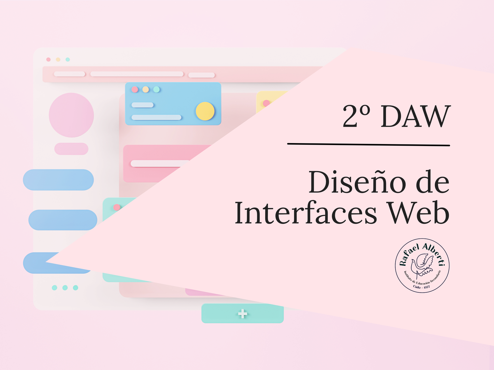

# Diseño de Interfaces Web

  

Material didáctico del módulo Diseño de Interfaces Web del CFGS Desarrollo de aplicaciones web del IES Rafael Alberti.

  

## Diapositivas

- [Presentación del módulo](https://envasadoralvacio.github.io/24-25-DIW/slides/presentacion.html)

## Referencias

- [Referencias del curso](https://envasadoralvacio.github.io/24-25-DIW/docs/referencias)

## Proyectos
- [Proyectos del curso](https://envasadoralvacio.github.io/24-25-DIW/docs/proyectos/)
