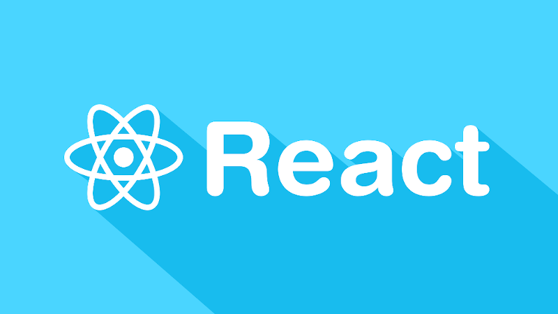

# UD5 - React.js

React es sin duda una de las tecnologías web más revolucionarias de la actualidad, fue lanzado por primera vez en 2013 por Facebook y es actualmente mantenido por ellos mismo y la comunidad de código abierto, la cual se extiende alrededor del mundo.

React, a diferencia de muchas tecnologías del desarrollo web, es una librería lo que lo hace mucho más fácil de implementar en muchos desarrollos, ya que se encarga **exclusivamente de la interfaz gráfica** del usuario y consume los datos a través de API que por lo general son REST.

El nombre de React proviene de su capacidad de crear **interfaces de usuario reactivas**, la cual es la capacidad de una aplicación para actualizar toda la interfaz gráfica en cadena, como si se tratara de una fórmula en Excel, donde al cambiar el valor de una celda automáticamente actualiza todas las celdas que depende del valor actualizado y esto se repite con las celdas que a la vez dependía de
estas últimas.

## Cómo funciona React 
React nos permite crear la interfaz UI mediante una sintaxis propia llamada Javascript XML (JSX) el cual es una mezcla entre XML y HTML que permite la construcción de elementos HTML de una forma muy simple y rápida.

Las aplicaciones desarrolladas mediante **JSX no pueden ser interpretadas por el navegador**, por lo que es requerido que todo el código sea convertido a Javascript nativo mediante un proceso llamado **transpilación**, el cual es parecido a la compilación, pero en este proceso no se lleva a cabo una compilación como tal, sino que el código es convertido de JSX a Javascript.

Este proceso es llevado a cabo mediante herramientas como Webpack el cual es el más ampliamente utilizado.

Como vemos en la imagen, Webpack es en realidad un empaquetador, el cual organiza, compacta y mediante plugins como Babel realiza la transpilación, arrojando como resultado una serie de archivos compactos y listos para ser utilizados.

## React y el Backend
React solo sirve para la creación de interfaz gráfica, por lo que **el desarrollo del backend queda fuera de React** y es precisamente eso lo que lo hace una librería super portable, ya que la podemos integrar con cualquier API ya desarrollada.

Cómo React no es capaz de resolver la parte del backend es necesario desarrollar el API de datos mediante otras tecnologías como NodeJS, el cual es por lo general el servidor más utilizado para el
desarrollo con React.

El API es consumido mediante AJAX a medida que la aplicación lo demanda.

## React y Web Components
React utiliza un concepto llamado Web Componentes, el cual es la creación de tus propias etiquetas de HTML para representar tus componentes. Te imaginas crear un login en tu página utilizando una etiqueta como esta <login\>, pues esta forma de trabajar es la que propone React, donde todo lo que desarrollemos sean componentes que puedan ser reutilizables cuantas veces queramos, incluso podrán ser empaquetadas como librerías para que las utilices en diferentes desarrollos. Esto lo puedes ver como si cada componente fuera una pequeña caja, y lo único que tenemos que hacer es colocar las cajas donde la necesitemos.

Como podemos ver en la imagen, cada parte de la aplicación puede ser un componente (etiqueta) el cual solo se tiene que agregar a la página para crear interfaces gráficas mucho más rápido. Ahora veamos cómo quedaría esta misma página, pero en código con React:

~~~
import React from 'react'
import NavBar from './NavBar'
import Login from './Login'
import Footer from './Footer'
class LoginApp extends React.Component{
  render(){
	return(
  	

    	<NavBar/>
    	<Login/>
    	<Footer/>
  	

	)
  }
}
~~~

Observemos que estamos utilizando las etiquetas como NavBar y Login,  las cuales no son propias de HTML.

## React y el Shadow DOM
Como se ha comentado anteriormente, React se ejecuta del lado de cliente, por lo que es esta misma la encargada de actualizar el DOM a medida que el usuario interactúa con la UI, sin embargo, el proceso de actualización del DOM es un trabajo muy costoso para el navegador, por lo que actualizar el DOM cada vez que el usuario realiza una acción, no es una opción, es por esto que React provee un DOM propio llamado Shadow DOM el cual es una versión del DOM sobre la cual React trabaja para
realizar los cambios, y una vez que calcula todos los cambios que hay que realizar es solo entonces cuando actualiza el DOM del navegador. 

Este proceso es en realidad muy complejo y React se encarga por completo de su gestión, por lo que como programadores no hace falta preocuparnos por estos detalles en la mayoría de las veces.

Cuando se realiza un cambio en el Shadow DOM, este se sincroniza con el DOM original y es necesario realizar un proceso llamado reconciliación, el cual es el encargado de aplicar los cambios del Shadow DOM al DOM real.

## React y los Estados
Una de las principales características de React es que los componentes pueden mantener estados. Los estados le indican los datos que el componente muestra, e incluso el formato en se muestran.

Por ejemplo, podemos tener un formulario, el cual tenga los estados de solo lectura y edición, en el primero, solo mostraremos los datos en texto plano, como un <p\> o un <span\> mientras que cuando el formulario está en estado de edición, podemos representar el formulario con <imput type=”text” /\>

Cuando un componente por alguna razón modifica su estado, entra en lo que se le conoce como Dirty o Sucio, y esto le indica a React que debe de haber un proceso de reconciliación para actualizar los datos en la UI.
Como ya hablamos en hace un momento, React utiliza programación Reactiva para actualizar los componentes, de tal forma, que cuando un componente es actualizado, todos los componentes hijos del árbol DOM serán evaluados para determinar si deben de ser también actualizados.

En la imagen podemos apreciar en rojo, los componentes que fueron actualizados por el usuario, por lo que React deberá iniciar el proceso dereconciliación para estos componentes, pero adicional, si
este componente tiene componentes hijos, React deberá determinar si los hijos necesitan ser también actualizados en cascada, a éste proceso es a lo que se le conoce como programación Reactiva.

## Deploy de React
Finalmente, React tiene una forma muy particular de ser cargado por el navegador, pues cuando el usuario entra a la página, está solo tiene un elemento, sobre el cual react montará toda la aplicación.

~~~
<!DOCTYPE html>
<html>
  <head>
  </head>
  <body>
    

    
  </body>
</html>
~~~

Adicional del elemento root, se carga un JavaScript llamado **bundle.js el cual es en realidad TODA LA APLICACIÓN en un solo archivo**, el cual es generado por Webpack tras ejecutar el proceso de transpilación.
Cuando el bundle.js se carga por completo, reemplaza el componente root por la aplicación
desarrollada en React.

