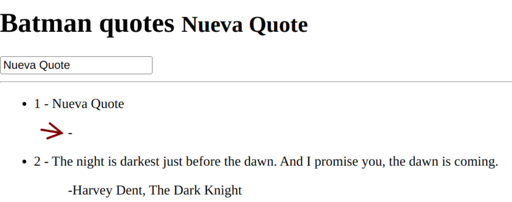

# Fundamentos Vue

## Usando Vue desde CDN

Antes de crear nuestras SPA con Vue vamos a revisar algunos de sus aspectos fundamentales. Para ello vamos a usar Vue directamente desde un CDN, incorporemos el siguiente enlace a nuestro HTML:

```
  <script src="https://unpkg.com/vue@3/dist/vue.global.js"></script>
```

index.html

```
<!DOCTYPE html>
<html lang="en">
<head>
    <meta charset="UTF-8">
    <title>Vue.js Intro</title>
      <script src="https://unpkg.com/vue@3/dist/vue.global.js"></script>
</head>
<body>
    <script src="app.js"></script>
</body>
</html>
```

Cuando se usa Vue desde un CDN, no hay un "paso de compilación" involucrado. Esto hace que la configuración sea mucho más simple y es adecuado para mejorar HTML estático o integrarse con un marco de back-end. Sin embargo, no podrá utilizar la sintaxis de componente de archivo único (SFC).

## La instancia de la aplicación

Cada aplicación de Vue comienza [creando una nueva instancia de aplicación](https://vuejs.org/guide/essentials/application.html#the-application-instance) con la createAppfunción:

app.js

```
const app = Vue.createApp({
  /* root component options */
})
```

## Montaje de la aplicación#

Una instancia de aplicación [no renderizará nada hasta que se llame a su método .mount()](https://vuejs.org/guide/essentials/application.html#mounting-the-app). Espera un argumento "contenedor", que puede ser un elemento DOM real o una cadena de selección:

app.js

```
const app = Vue.createApp({
  /* root component options */
})

app.mount('#myApp')

```

index.html

```
<!DOCTYPE html>
<html lang="en">
  <head>
    <meta charset="UTF-8" />
    <title>Vue.js Intro</title>
      <script src="https://unpkg.com/vue@3/dist/vue.global.js"></script>
  </head>
  <body>
    <div id="myApp">
        <!-- Control absoluto de este DIV -->
    </div>
    <script src="app.js"></script>
  </body>
</html>
```

El contenido del componente raíz de la aplicación se representará dentro del elemento contenedor myApp. El elemento contenedor en sí no se considera parte de la aplicación.

## Sintaxis de plantilla

Vue utiliza una [sintaxis de plantilla](https://vuejs.org/guide/essentials/template-syntax.html#template-syntax) basada en HTML que le permite vincular declarativamente el DOM.
Vue compila las plantillas en un código JavaScript altamente optimizado Combinado con la reactividad, Vue es capaz de calcular la cantidad mínima de componentes a renderizar y aplicar la cantidad mínima de manipulaciones en el DOM.

app.js

```
const app = Vue.createApp({
    template: `
    <h1> Hola Vue3 </h1>
    <p> Desde app.js </p>
    `
})

app.mount('#myApp')
```

## Interpolación de texto

La [interpolación](https://vuejs.org/guide/essentials/template-syntax.html#text-interpolation) de texto (bigote o llaves dobles) es una forma de insertar valores en una plantilla.

app.js

```
const app = Vue.createApp({
    template: `
    <h1> Hola Vue3 </h1>
    <p> {{ 1+ 1 }} </p>
    `
})

app.mount('#myApp')
```

Igualmente podemos usar la interpolación en nuestro archivo HTML directamente, el siguiente código nos daría la misma salida que el anterior:

app.js

```
const app = Vue.createApp({
    // template: `
    // <h1> Hola Vue3 </h1>
    // <p> {{ 1+ 1 }} </p>
    `
})

app.mount('#myApp')
```

index.html

```
<!DOCTYPE html>
<html lang="en">
  <head>
    <meta charset="UTF-8" />
    <title>Vue.js Intro</title>
      <script src="https://unpkg.com/vue@3/dist/vue.global.js"></script>
  </head>
  <body>
    <div id="myApp">
        <!-- Control absoluto de este DIV -->
        <h1> Hola Vue3 </h1>
        <p> {{ 1+ 1 }} </p>
    </div>
    <script src="app.js"></script>
  </body>
</html>
```

En la interpolación o renderarización declarativa podemos usar expresiones de javascript, pero no todas son validas. Por ejemplo, no podemos usar, if, for, while...

## Declaración de estado reactivo

Con la API de opciones, [usamos la opción data para declarar el estado reactivo de un componente](https://vuejs.org/guide/essentials/reactivity-fundamentals.html#declaring-reactive-state).

app.js

```
const app = Vue.createApp({
 data() {
    return {
      message: "I'm Batman",
    }
  },
})

app.mount('#myApp')
```

Ese message que hemos declarado podemos ahora usarlo en nuestro HTML..

index.html

```
<!DOCTYPE html>
<html lang="en">
  <head>
    <meta charset="UTF-8" />
    <title>Vue.js Intro</title>
      <script src="https://unpkg.com/vue@3/dist/vue.global.js"></script>
  </head>
  <body>
    <div id="myApp">
        <h1> Hola Vue3 </h1>
        <p> {{ message }} </p>
    </div>
    <script src="app.js"></script>
  </body>
</html>
```

Cada vez que cambie el valor de message, Vue se encargará de pintar los cambios en el HTML.

Podemos crear las propiedades que necesitemos:

app.js

```
const app = Vue.createApp({
  data() {
    return {
      quote: "I'm Batman",
      author: 'Bruce Wayne',
    }
  }
})

app.mount('#myApp')
```

index.html

```
<!DOCTYPE html>
<html lang="en">
  <head>
    <meta charset="UTF-8" />
    <title>Vue.js Intro</title>
      <script src="https://unpkg.com/vue@3/dist/vue.global.js"></script>
  </head>
  <body>
    <div id="myApp">
      <h3>{{ quote }}</h3>
      <blockquote>-{{ author }}</blockquote>
    </div>
    <script src="app.js"></script>
  </body>
</html>
```

## Directivas de Vue

Las directivas de Vue son atributos especiales que se colocan en las etiquetas HTML y están prefijados por v-, como por ejemplo, v-for, v-bind o v-on, entre muchas otras. Estas directivas permiten realizar acciones dinámicas potentes (bucles, condicionales, etc...) que no se pueden realizar en HTML por si solo.

<center>

</center>

### Manejo de eventos

Para escuhar [eventos DOM](https://vuejs.org/guide/essentials/event-handling.html) y ejecutar JavaScript cuando se activan podemos usar la directiva v-on, que normalmente acortamos al símbolo @.

El uso sería v-on:click="handler" o con el atajo, @click="handler".

Partiendo del código del ejemplo anterior vamos a implementar un botón que al hacer click en el mismo cambiemos el author de la quote.

index.html

```
<!DOCTYPE html>
<html lang="en">
  <head>
    <meta charset="UTF-8" />
    <title>Vue.js Intro</title>
      <script src="https://unpkg.com/vue@3/dist/vue.global.js"></script>
  </head>
  <body>
    <div id="myApp">
      <h3>{{ quote }}</h3>
      <blockquote>-{{ author }}</blockquote>
      <button v-on:click="changeQuote">Change quote</button>
    </div>
    <script src="app.js"></script>
  </body>
</html>
```

Ya tenemos un botón que al hacer cick en el va a llamar a una función changeQuote, ahora implementamos dicha función o método en nuestro app.js.

app.js

```
const app = Vue.createApp({
  data() {
    return {
      quote: "I'm Batman",
      author: 'Bruce Wayne',
    }
  },
  methods: {
    changeQuote() {
      console.log('Hola desde changeQuote')
      this.author = 'Manuel Rivas'
    }
  }
})

app.mount('#myApp')
```

### Directiva v-for

La directiva [v-for](https://vuejs.org/guide/essentials/list.html) se usa para iterar sobre una lista de elementos.
Para que Vue pueda rastrear la identidad de cada nodo y, por lo tanto, reutilizar y reordenar los elementos existentes, tenemos que proporcionar un atributo key único para cada elemento.

Para este ejemplo vamos a utilizar una [lista de quotes](assets/codigo-vue/quotes.txt) que vamos a colocar en nuestro archivo app.js:

app.js

```
const quotes = [
  {
    quote:
      'The night is darkest just before the dawn. And I promise you, the dawn is coming.',
    author: 'Harvey Dent, The Dark Knight',
  },
  {
    quote: 'I believe what doesn’t kill you simply makes you, stranger.',
    author: 'The Joker, The Dark Knight',
  },
  {
    quote:
      'Your anger gives you great power. But if you let it, it will destroy you… As it almost did me',
    author: 'Henri Ducard, Batman Begins',
  },
  {
    quote:
      'You either die a hero or live long enough to see yourself become the villain.',
    author: 'Harvey Dent, The Dark Knight',
  },
  {
    quote: 'If you’re good at something, never do it for free.',
    author: 'The Joker, The Dark Knight',
  },
  {
    quote: 'Yes, father. I shall become a bat.',
    author: 'Bruce Wayne/Batman, Batman: Year One',
  },
]

const app = Vue.createApp({
  data() {
    return {

    }
  },
})

app.mount('#myApp')

```

Para que estan quotes entren a formar parte de la reactividad de Vue, tenemos que, de alguna manera, pasarselas a nuestra app vue:

app.js

```
const quotes = [
  {
    quote:
      'The night is darkest just before the dawn. And I promise you, the dawn is coming.',
    author: 'Harvey Dent, The Dark Knight',
  },
  {
    quote: 'I believe what doesn’t kill you simply makes you, stranger.',
    author: 'The Joker, The Dark Knight',
  },
  {
    quote:
      'Your anger gives you great power. But if you let it, it will destroy you… As it almost did me',
    author: 'Henri Ducard, Batman Begins',
  },
  {
    quote:
      'You either die a hero or live long enough to see yourself become the villain.',
    author: 'Harvey Dent, The Dark Knight',
  },
  {
    quote: 'If you’re good at something, never do it for free.',
    author: 'The Joker, The Dark Knight',
  },
  {
    quote: 'Yes, father. I shall become a bat.',
    author: 'Bruce Wayne/Batman, Batman: Year One',
  },
]

const app = Vue.createApp({
  data() {
    return {
        quotes:quotes
    }
  },
})

app.mount('#myApp')

```

De esta manera ya podríamos reenderizar el elemento en el HTML.

index.html

```
<!DOCTYPE html>
<html lang="en">
  <head>
    <meta charset="UTF-8" />
    <title>Vue.js Intro</title>
      <script src="https://unpkg.com/vue@3/dist/vue.global.js"></script>
  </head>
  <body>
    <div id="myApp">
        <h1>Batman quotes</h1>
        <hr>
        {{ quotes }}
    </div>
    <script src="app.js"></script>
  </body>
</html>
```

Ahora, haciendo uso de la directiva v-for, vamos a recorrer la lista y a pintarla por pantalla.

index.html

```
<!DOCTYPE html>
<html lang="en">
  <head>
    <meta charset="UTF-8" />
    <title>Vue.js Intro</title>
      <script src="https://unpkg.com/vue@3/dist/vue.global.js"></script>
  </head>
  <body>
    <div id="myApp">
        <h1>Batman quotes</h1>
        <hr>
        <ul>
            <li v-for="({ quote, author }, index) in quotes">
                <span>{{ index + 1 }} - {{ quote }}</span>
                <blockquote>-{{ author }}</blockquote>
            </li>
        </ul>
    </div>
    <script src="app.js"></script>
  </body>
</html>
```

A continuación vamos a poner un input que nos permita escribir algo y al presionar intro poder crear un nuevo quote, utilizaremos para ello la directiva v-model.

### Directiva v-model

[v-model](https://vuejs.org/guide/components/v-model.html#component-v-model) se puede utilizar en un componente para implementar un enlace bidireccional.

En primer lugar vamos a crearnos una nueva propiedad reactiva, newQuote, para posteriormente almacenar el contenido del input. Tambien vamos a implementar el input en el html.

app.js

```
const quotes = [
  {
    quote:
      'The night is darkest just before the dawn. And I promise you, the dawn is coming.',
    author: 'Harvey Dent, The Dark Knight',
  },
  {
    quote: 'I believe what doesn’t kill you simply makes you, stranger.',
    author: 'The Joker, The Dark Knight',
  },
  {
    quote:
      'Your anger gives you great power. But if you let it, it will destroy you… As it almost did me',
    author: 'Henri Ducard, Batman Begins',
  },
  {
    quote:
      'You either die a hero or live long enough to see yourself become the villain.',
    author: 'Harvey Dent, The Dark Knight',
  },
  {
    quote: 'If you’re good at something, never do it for free.',
    author: 'The Joker, The Dark Knight',
  },
  {
    quote: 'Yes, father. I shall become a bat.',
    author: 'Bruce Wayne/Batman, Batman: Year One',
  },
]

const app = Vue.createApp({
  data() {
    return {
        quotes:quotes,
        newQuote: 'Hola mundo',
    }
  },
})

app.mount('#myApp')
```

index.html

```
<!DOCTYPE html>
<html lang="en">
  <head>
    <meta charset="UTF-8" />
    <title>Vue.js Intro</title>
      <script src="https://unpkg.com/vue@3/dist/vue.global.js"></script>
  </head>
  <body>
    <div id="myApp">
        <h1>Batman quotes</h1>
        <input type="text">
        <hr>
        <ul>
            <li v-for="({ quote, author }, index) in quotes">
                <span>{{ index + 1 }} - {{ quote }}</span>
                <blockquote>-{{ author }}</blockquote>
            </li>
        </ul>
    </div>
    <script src="app.js"></script>
  </body>
</html>
```

Ya lo tenemos preparado, pero no hay ninguna relación ente el input y la propiedad que hemos creado, para ello vamos a usar la directiva v-model.

index.html

```
<!DOCTYPE html>
<html lang="en">
  <head>
    <meta charset="UTF-8" />
    <title>Vue.js Intro</title>
      <script src="https://unpkg.com/vue@3/dist/vue.global.js"></script>
  </head>
  <body>
    <div id="myApp">
        <h1>Batman quotes  <small>{{ newQuote }}</small> </h1>
        <input
          type="text"
          v-model="newQuote">
        <hr>
        <ul>
            <li v-for="({ quote, author }, index) in quotes">
                <span>{{ index + 1 }} - {{ quote }}</span>
                <blockquote>-{{ author }}</blockquote>
            </li>
        </ul>
    </div>
    <script src="app.js"></script>
  </body>
</html>
```

Estamos pintando newQuote dentro de una etiqueta span para comprobar que efectivamente está funcionando. Ahora volvemos a utilizar la directiva v-on para escuchar el evento intro y añadir el nuevo quote a las ya existentes.

index.html

```
<!DOCTYPE html>
<html lang="en">
  <head>
    <meta charset="UTF-8" />
    <title>Vue.js Intro</title>
    <script src="https://unpkg.com/vue@3/dist/vue.global.js"></script>
  </head>
  <body>
    <div id="myApp">
        <h1>Batman quotes  <small>{{ newQuote }}</small> </h1>
        <input
          type="text"
          v-model="newQuote"
          v-on:keypress="addQuote">
        <hr>
        <ul>
            <li v-for="({ quote, author }, index) in quotes">
                <span>{{ index + 1 }} - {{ quote }}</span>
                <blockquote>-{{ author }}</blockquote>
            </li>
        </ul>
    </div>
    <script src="app.js"></script>
  </body>
</html>
```

Ahora tenemos que implementar ese nuevo método addQuote, para que al presionar intro, añada la nueva quote.

app.js

```
const quotes = [
  {
    quote:
      'The night is darkest just before the dawn. And I promise you, the dawn is coming.',
    author: 'Harvey Dent, The Dark Knight',
  },
  {
    quote: 'I believe what doesn’t kill you simply makes you, stranger.',
    author: 'The Joker, The Dark Knight',
  },
  {
    quote:
      'Your anger gives you great power. But if you let it, it will destroy you… As it almost did me',
    author: 'Henri Ducard, Batman Begins',
  },
  {
    quote:
      'You either die a hero or live long enough to see yourself become the villain.',
    author: 'Harvey Dent, The Dark Knight',
  },
  {
    quote: 'If you’re good at something, never do it for free.',
    author: 'The Joker, The Dark Knight',
  },
  {
    quote: 'Yes, father. I shall become a bat.',
    author: 'Bruce Wayne/Batman, Batman: Year One',
  },
]

const app = Vue.createApp({
  data() {
    return {
      quotes,
      newQuote: 'Hola mundo',
    }
  },
  methods: {
    addQuote(e) {
        console.log(e)
        if (e.charCode !== 13) return
        this.quotes.unshift({
            quote: this.newQuote,
        })
    },
  },
})

app.mount('#myApp')
```

Nuesto código ya cumple con nuestro objetivo, pero es mejorable, podemos usar los modificadores de eventos de vue.

### Modificadores de eventos

Hay ciertos eventos que se usan con asiduidad, por ejemplo event.preventDefault(), para evitar tener que lidiar con detalles de eventos DOM Vue proporciona una serie de [modificadores de eventos](https://vuejs.org/guide/essentials/event-handling.html#event-modifiers) para v-on. Estos modificadores son sufijos de directiva indicados por un punto.

En esta ocasión vamos a usar un modificador para mejorar el código anterior.

index.html

```
<!DOCTYPE html>
<html lang="en">
  <head>
    <meta charset="UTF-8" />
    <title>Vue.js Intro</title>
    <script src="https://unpkg.com/vue@3/dist/vue.global.js"></script>
  </head>
  <body>
    <div id="myApp">
        <h1>Batman quotes  <small>{{ newQuote }}</small> </h1>
        <input
          type="text"
          v-model="newQuote"
          v-on:keypress.enter="addQuote">
        <hr>
        <ul>
            <li v-for="({ quote, author }, index) in quotes">
                <span>{{ index + 1 }} - {{ quote }}</span>
                <blockquote>-{{ author }}</blockquote>
            </li>
        </ul>
    </div>
    <script src="app.js"></script>
  </body>
</html>
```

app.js

```
const quotes = [
  {
    quote:
      'The night is darkest just before the dawn. And I promise you, the dawn is coming.',
    author: 'Harvey Dent, The Dark Knight',
  },
  {
    quote: 'I believe what doesn’t kill you simply makes you, stranger.',
    author: 'The Joker, The Dark Knight',
  },
  {
    quote:
      'Your anger gives you great power. But if you let it, it will destroy you… As it almost did me',
    author: 'Henri Ducard, Batman Begins',
  },
  {
    quote:
      'You either die a hero or live long enough to see yourself become the villain.',
    author: 'Harvey Dent, The Dark Knight',
  },
  {
    quote: 'If you’re good at something, never do it for free.',
    author: 'The Joker, The Dark Knight',
  },
  {
    quote: 'Yes, father. I shall become a bat.',
    author: 'Bruce Wayne/Batman, Batman: Year One',
  },
]

const app = Vue.createApp({
  data() {
    return {
      quotes,
      newQuote: 'Hola mundo',
    }
  },
  methods: {
    addQuote() {
      this.quotes.unshift({
        quote: this.newQuote,
      })
    },
  },
})

app.mount('#myApp')
```

En la siguiente imagen podemos ver que si ejecutamos la aplicación ya podemos insertar nuevas quotes, pero queda algo raro, pinta el - del campo author aunque no tenga contenido.

<center>

</center>

Vamos a solucionarlo utilizando una nueva directiva, v-if.

### Directiva v-if

La directiva [v-if](https://vuejs.org/guide/essentials/conditional.html) se usa para renderizar condicionalmente un bloque. El bloque solo se representará si la expresión de la directiva devuelve un valor verdadero.

index.html

```
<!DOCTYPE html>
<html lang="en">
  <head>
    <meta charset="UTF-8" />
    <title>Vue.js Intro</title>
      <script src="https://unpkg.com/vue@3/dist/vue.global.js"></script>
  </head>
  <body>
    <div id="myApp">
        <h1>Batman quotes  <small>{{ newQuote }}</small> </h1>
        <input
          type="text"
          v-model="newQuote"
          v-on:keypress.enter="addQuote">
        <hr>
        <ul>
            <li v-for="({ quote, author }, index) in quotes">
                <span>{{ index + 1 }} - {{ quote }}</span>
                <blockquote v-if="author">-{{ author }}</blockquote>
            </li>
        </ul>
    </div>
    <script src="app.js"></script>
  </body>
</html>
```

### Directiva v-show

Otra opción para mostrar condicionalmente un elemento es la directiva [v-show](https://vuejs.org/guide/essentials/conditional.html#v-show). El uso es básicamente el mismo:

index.html

```
<!DOCTYPE html>
<html lang="en">
  <head>
    <meta charset="UTF-8" />
    <title>Vue.js Intro</title>
      <script src="https://unpkg.com/vue@3/dist/vue.global.js"></script>
  </head>
  <body>
    <div id="myApp">
        <h1>Batman quotes  <small>{{ newQuote }}</small> </h1>
        <input
          type="text"
          v-model="newQuote"
          v-on:keypress.enter="addQuote">
        <hr>
        <ul>
            <li v-for="({ quote, author }, index) in quotes">
                <span>{{ index + 1 }} - {{ quote }}</span>
                <blockquote v-show="author">- {{author}}</blockquote>
            </li>
        </ul>
    </div>
    <script src="app.js"></script>
  </body>
</html>
```

La diferencia es que un elemento con v-show siempre se renderizará y permanecerá en el DOM; v-show solo cambia la propiedad display del CSS del elemento.

En base a eso, podemos decir que v-if tiene costos de alternancia más altos mientras que v-show tiene costos de renderización inicial más altos. Así que mejor usar v-show si necesitas alternar algo con mucha frecuencia, y mejor v-if si es poco probable que la condición cambie en el tiempo de ejecución.

### v-if con v-for

La guía de vue no recomienda usar [v-if y v-for](https://vuejs.org/guide/essentials/conditional.html#v-if-with-v-for) en el mismo elemento debido a la precedencia implícita. Consultar la [guía](https://vuejs.org/style-guide/rules-essential.html#avoid-v-if-with-v-for) de estilo para más detalles.

Cuando usemos [v-for v-if](https://vuejs.org/guide/essentials/list.html#v-for-with-v-if), v-if tiene una prioridad más alta que v-for.

Eso significa que la condición v-if no tendrá acceso a las variables del alcance de v-for.

Si aplicamos esto a nuestro ejemplo y colocamos el v-for y v-if en el mimso elemento:

```
<!DOCTYPE html>
<html lang="en">
  <head>
    <meta charset="UTF-8" />
    <meta http-equiv="X-UA-Compatible" content="IE=edge" />
    <meta name="viewport" content="width=device-width, initial-scale=1.0" />
    <title>Document</title>
    <script src="https://unpkg.com/vue@3/dist/vue.global.js"></script>
  </head>
  <body>
    <div id="myApp">
      <h1>Batman Quotes</h1>
      <input type="text" v-model="newQuote" v-on:keypress.enter="addQuote" />
      <hr />
      <ul>
        <li v-for="({quote, author}, index) in quotes" v-if="author">
          <span>{{quote}} </span>
          <blockquote>- {{author}}</blockquote>
        </li>
      </ul>
    </div>
  </body>
  <script src="app.js"></script>
</html>
```

Vemos que no nos pinta nada por pantalla, esto se debe a que como nos indica Vue, el v-if tiene prioridad y por ello no puede acceder al valor de los elementos del v-for.

Una posible solución puede ser llevar el v-for a un elemento de nivel superior, por ejemplo:

```
<!DOCTYPE html>
<html lang="en">
  <head>
    <meta charset="UTF-8" />
    <meta http-equiv="X-UA-Compatible" content="IE=edge" />
    <meta name="viewport" content="width=device-width, initial-scale=1.0" />
    <title>Document</title>
    <script src="https://unpkg.com/vue@3/dist/vue.global.js"></script>
  </head>
  <body>
    <div id="myApp">
      <h1>Batman Quotes</h1>
      <input type="text" v-model="newQuote" v-on:keypress.enter="addQuote" />
      <hr />
      <ul v-for="({quote, author}, index) in quotes">
        <li v-if="author">
          <span>{{quote}} </span>
          <blockquote>- {{author}}</blockquote>
        </li>
      </ul>
    </div>
  </body>
  <script src="app.js"></script>
</html>
```

### v-else y v-else-if

Tambien tenemos una directiva [v-else](https://es.vuejs.org/v2/guide/conditional.html#v-else) y [v-else-if](v-else-if).

```
const app = Vue.createApp({
  template: `
  <h1>Hola {{ name }}!</h1>
  <h2 v-if="active">v-if en acción</h2>
  <h2 v-else>v-else en acción</h2>
  `,

  data() {
    return {
      name: 'Vue 3',
      active: null,
    }
  },
})

app.mount('#myApp')
```

```
const app = Vue.createApp({
  template: `
    <h1>Hola {{ name }}!</h1>
    <h2 v-if="active === true">Estoy en true</h2>
    <h2 v-else-if="active === false">Estoy en false</h2>
    <h2 v-else>Estoy indeciso</h2>
  `,

  data() {
    return {
      name: 'Vue 3',
      active: null,
    }
  },
})

app.mount('#myApp')
```

Un elemento v-else debe seguir inmediatamente a un v-if o un v-else-if elemento; de lo contrario, no se reconocerá.

💔 Incorrecto:

```
const app = Vue.createApp({
  template: `
    <h1>Hola {{ name }}!</h1>
    <h2 v-if="active === true">Estoy en true</h2>
    <h2 v-else-if="active === false">Estoy en false</h2>
    <p>Lorem ipsum dolor sit</p>
    <h2 v-else>Estoy indeciso</h2>
  `,

  data() {
    return {
      name: 'Vue 3',
      active: null,
    }
  },
})

app.mount('#myApp')
```

### Directiva v-bind

La directiva [v-bind](https://es.vuejs.org/v2/guide/class-and-style.html) es una de las directivas más utilizadas y populares de Vue. Esta directiva permite enlazar (bindear) una variable de Vue con un atributo específico de una etiqueta HTML. De esta forma, podemos colocar como valor de un atributo HTML el contenido que tengamos almacenado en una variable de la lógica de Javascript.

```
const app = Vue.createApp({
  template: `
  <h1>Hola {{ name }}!</h1>
  <h2 v-bind:style="styleColor">Hola {{ name }}</h2>
  
  `,

  data() {
    return {
      name: 'Vue 3',
      styleColor: 'color: red;',
      image: 'https://avatars.githubusercontent.com/u/6128107?s=280&v=4',
      text: 'Logo de Vue',
    }
  },
})

app.mount('#myApp')
```

Debido a que v-bind se usa con tanta frecuencia, tiene una sintaxis abreviada dedicada:

```
<h2 :style="styleColor">Hola {{ name }}</h2>
```

## Deploy

```
npm run build
npm run preview
```
