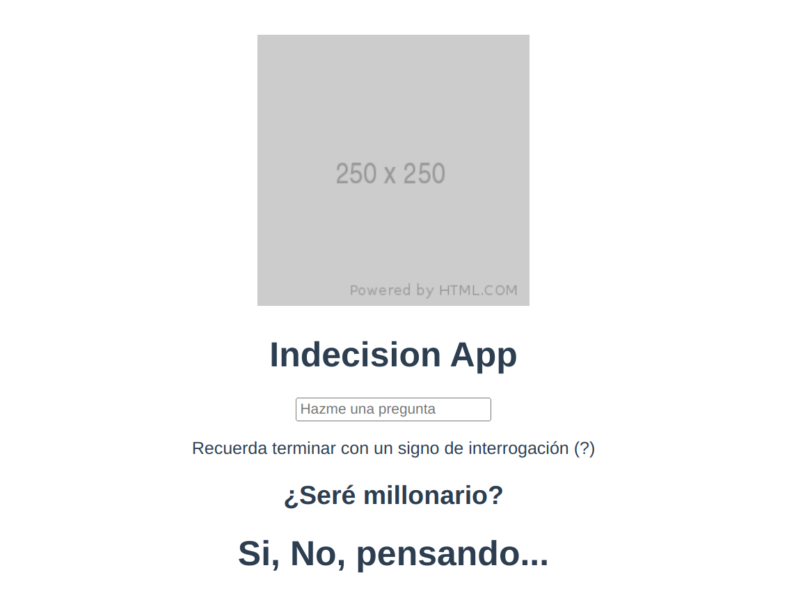

# Indecision App

En esta sección vamos a realizar una pequeña aplicación a la cual le vamos a poder hacer preguntas "existenciales" y ésta nos responderá si o no.

Es una aplicación sencilla que va a realizar llamadas a una [API](https://yesno.wtf/#api), observar los cambios en un input, y alguna cosilla mas. El objetivo de la misma es consolidar el conocimiento de los elementos fundamentales del Option API de Vue.js.

## Demo del objetivo final

En el siguiente enlace podemos ver un despligue de como se verá la aplicación una vez terminada:

- [Despliegue de la Indecision App](https://polite-mermaid-457575.netlify.app/)

## Recursos para el desarrollo de la App

Algunos recursos que vamos a necesitar:

- [Enlace a la API yesno.wtf](https://yesno.wtf/#api)
- [CSS para la aplicación](assets/codigo-vue/Indecision.css.txt)


## Comenzamos el proyecto

Vamos, en primer lugar, a comenzar un nuevo proyecto Vue utilizando vite.

```
npm init vue@latest
```

```
Vue.js - The Progressive JavaScript Framework

✔ Project name: … IndecisionApp
✔ Package name: … indecisionapp
✔ Add TypeScript? … No / Yes
✔ Add JSX Support? … No / Yes
✔ Add Vue Router for Single Page Application development? … No / Yes
✔ Add Pinia for state management? … No / Yes
✔ Add Vitest for Unit Testing? … No / Yes
✔ Add an End-to-End Testing Solution? › No
✔ Add ESLint for code quality? … No / Yes

Scaffolding project in /xxx/xxx/IndecisionApp...

Done. Now run:

  cd IndecisionApp
  npm install
  npm run dev

```

Una vez que tenemos creado el proyecto, eliminamos los elementos que genera por defecto y nos vamos a utilizar, componentes, archivos css, etc....

A continuación, sustituimos el código del App.vue a un componente limpio y le añadimos el css que tenemos en el archivo que hemos descargado en el apartado anterior.

```
<template></template>

<script>
export default {}
</script>

<style>
#app {
  font-family: Avenir, Helvetica, Arial, sans-serif;
  -webkit-font-smoothing: antialiased;
  -moz-osx-font-smoothing: grayscale;
  text-align: center;
  color: #2c3e50;
  margin-top: 60px;
}
</style>

```

## Indecision component

Vamos a crear un nuevo componente, Indecision.vue, dentro de la carpeta components, le añadimos el css y lo mostramos en el App.vue.

Indecision.vue

```
<template>
  <h1>Indecision App</h1>
</template>

<script>
export default {}
</script>
```

App.vue

```
<template>
  <Indecision />
</template>

<script>
import Indecision from './components/Indecision.vue'

export default {
  components: { Indecision },
}
</script>

<style>
#app {
  font-family: Avenir, Helvetica, Arial, sans-serif;
  -webkit-font-smoothing: antialiased;
  -moz-osx-font-smoothing: grayscale;
  text-align: center;
  color: #2c3e50;
  margin-top: 60px;
}
</style>
```

Ahora vamos a crearnos el "cascaron de la aplicación".

Indecision.vue

```
<template>
  
  <div class="bg-dark"></div>
  <div class="indecision-container">
    <h1>Indecision App</h1>
    <input type="text" placeholder="Hazme una pregunta" />
    <p>Recuerda terminar con un signo de interrogación (?)</p>
    <div>
      <h2>¿Seré millonario?</h2>
      <h1>Si, No, pensando...</h1>
    </div>
  </div>
</template>

<script>
export default {}
</script>
```

A estas alturas ya tenemos creada la estructura de como queremos que nos quede la aplicación:

<center>

</center>

Le añadimos el css que tenemos en el archivo adjunto:

Indecision.vue

```
<template>
  
  <div class="bg-dark"></div>
  <div class="indecision-container">
    <h1>Indecision App</h1>
    <input type="text" placeholder="Hazme una pregunta" />
    <p>Recuerda terminar con un signo de interrogación (?)</p>
    <div>
      <h2>¿Seré millonario?</h2>
      <h1>Si, No, pensando...</h1>
    </div>
  </div>
</template>

<script>
export default {}
</script>

<style>
img,
.bg-dark {
  height: 100vh;
  left: 0px;
  max-height: 100%;
  max-width: 100%;
  position: fixed;
  top: 0px;
  width: 100vw;
}

.bg-dark {
  background-color: rgba(0, 0, 0, 0.4);
}

.indecision-container {
  position: relative;
  z-index: 99;
}

input {
  width: 250px;
  padding: 10px 15px;
  border-radius: 5px;
  border: none;
  margin: 20px;
}
input:focus {
  outline: none;
}

p {
  color: white;
  font-size: 20px;
  margin-top: 0px;
}

h1,
h2 {
  color: white;
}

h2 {
  margin-top: 150px;
}
</style>
```

Y ahora tendremos algo, como:

<center>

</center>

Ahora vamos a necesitar "capturar" lo que los usuarios escriban en el input, para ello vamos a declarar uana propiedad reactiva y enlazarla al input.

Indecision.vue

```
<template>
  
  <div class="bg-dark"></div>
  <div class="indecision-container">
    <h1>Indecision App</h1>
    <input v-model="question" type="text" placeholder="Hazme una pregunta" />
    <p>Recuerda terminar con un signo de interrogación (?)</p>
    <div>
      <h2>{{ question }}</h2>
      <h1>Si, No, pensando...</h1>
    </div>
  </div>
</template>

<script>
export default {
  data() {
    return {
      question: 'Pregunta inicial',
    }
  },
}
</script>

<style>
img,
.bg-dark {
  height: 100vh;
  left: 0px;
  max-height: 100%;
  max-width: 100%;
  position: fixed;
  top: 0px;
  width: 100vw;
}

.bg-dark {
  background-color: rgba(0, 0, 0, 0.4);
}

.indecision-container {
  position: relative;
  z-index: 99;
}

input {
  width: 250px;
  padding: 10px 15px;
  border-radius: 5px;
  border: none;
  margin: 20px;
}
input:focus {
  outline: none;
}

p {
  color: white;
  font-size: 20px;
  margin-top: 0px;
}

h1,
h2 {
  color: white;
}

h2 {
  margin-top: 150px;
}
</style>
```

## Watch - Observar cambios en una propiedad reactiva

Hay casos en los que necesitamos realizar "efectos secundarios" en reacción a los cambios de estado, por ejemplo, mutar el DOM.

Con la API de opciones, podemos usar la opción [watch](https://vuejs.org/guide/essentials/watchers.html) para activar una función cada vez que cambia una propiedad reactiva.

En nuestra aplicación vamos a necesitar que cuando el usuario escriba una "?" en el input se dispare la llamada a la API, para esto vamos a declarar un watch.

Indecision.vue

```
<template>
  
  <div class="bg-dark"></div>
  <div class="indecision-container">
    <h1>Indecision App</h1>
    <input v-model="question" type="text" placeholder="Hazme una pregunta" />
    <p>Recuerda terminar con un signo de interrogación (?)</p>
    <div>
      <h2>{{ question }}</h2>
      <h1>Si, No, pensando...</h1>
    </div>
  </div>
</template>

<script>
export default {
  data() {
    return {
      question: 'Pregunta inicial',
    }
  },
  watch: {
    question(value, oldvalue) {
      console.log(value, oldvalue)
      if (!value.includes('?')) return
      console.log('Se ha detectado una ?')

      // TODO: Llamada HTTP
    },
  },
}
</script>

<style>
img,
.bg-dark {
  height: 100vh;
  left: 0px;
  max-height: 100%;
  max-width: 100%;
  position: fixed;
  top: 0px;
  width: 100vw;
}

.bg-dark {
  background-color: rgba(0, 0, 0, 0.4);
}

.indecision-container {
  position: relative;
  z-index: 99;
}

input {
  width: 250px;
  padding: 10px 15px;
  border-radius: 5px;
  border: none;
  margin: 20px;
}
input:focus {
  outline: none;
}

p {
  color: white;
  font-size: 20px;
  margin-top: 0px;
}

h1,
h2 {
  color: white;
}

h2 {
  margin-top: 150px;
}
</style>
```

## Petición HTTP

Realizamos la petición HTTP a la API. Implementamos un método para hacer la llamada, no sería una buena práctica hacerla en el watcher.

Indecision.vue

```
<template>
  
  <div class="bg-dark"></div>
  <div class="indecision-container">
    <h1>Indecision App</h1>
    <input v-model="question" type="text" placeholder="Hazme una pregunta" />
    <p>Recuerda terminar con un signo de interrogación (?)</p>
    <div>
      <h2>{{ question }}</h2>
      <h1>Si, No, pensando...</h1>
    </div>
  </div>
</template>

<script>
export default {
  data() {
    return {
      question: 'Pregunta inicial',
    }
  },
  methods: {
    async getAnswer() {
      this.answer = 'Pensando...'
      const data = await fetch('https://yesno.wtf/api').then((res) =>
        res.json()
      )
      console.log(data)
    },
  },
  watch: {
    question(value, oldvalue) {
      console.log(value, oldvalue)
      if (!value.includes('?')) return
      console.log('Se ha detectado una ?')

      // TODO: Llamada HTTP
      this.getAnswer()
    },
  },
}
</script>

<style>
img,
.bg-dark {
  height: 100vh;
  left: 0px;
  max-height: 100%;
  max-width: 100%;
  position: fixed;
  top: 0px;
  width: 100vw;
}

.bg-dark {
  background-color: rgba(0, 0, 0, 0.4);
}

.indecision-container {
  position: relative;
  z-index: 99;
}

input {
  width: 250px;
  padding: 10px 15px;
  border-radius: 5px;
  border: none;
  margin: 20px;
}
input:focus {
  outline: none;
}

p {
  color: white;
  font-size: 20px;
  margin-top: 0px;
}

h1,
h2 {
  color: white;
}

h2 {
  margin-top: 150px;
}
</style>
```

Vamos a desestructurar la respuesta de la API y almacenarla en dos propiedades reactivas, answer y img. El contenido de estas dos propiedes lo usaremos para pintar la respuesta en nuestro HTML y sustituir la imagen.

Indecision.vue

```
<template>
  
  <div class="bg-dark"></div>
  <div class="indecision-container">
    <h1>Indecision App</h1>
    <input v-model="question" type="text" placeholder="Hazme una pregunta" />
    <p>Recuerda terminar con un signo de interrogación (?)</p>
    <div>
      <h2>{{ question }}</h2>
      <h1>{{ answer }}</h1>
    </div>
  </div>
</template>

<script>
export default {
  data() {
    return {
      question: null,
      answer: null,
      img: null,
    }
  },
  methods: {
    async getAnswer() {
      this.answer = 'Pensando...'
      const data = await fetch('https://yesno.wtf/api').then((res) =>
        res.json()
      )
      const { answer, image } = data
      this.answer = answer
      this.img = image
    },
  },
  watch: {
    question(value, oldvalue) {
      console.log(value, oldvalue)
      if (!value.includes('?')) return
      // console.log('Se ha detectado una ?')
      this.getAnswer()
    },
  },
}
</script>

<style>
img,
.bg-dark {
  height: 100vh;
  left: 0px;
  max-height: 100%;
  max-width: 100%;
  position: fixed;
  top: 0px;
  width: 100vw;
}

.bg-dark {
  background-color: rgba(0, 0, 0, 0.4);
}

.indecision-container {
  position: relative;
  z-index: 99;
}

input {
  width: 250px;
  padding: 10px 15px;
  border-radius: 5px;
  border: none;
  margin: 20px;
}
input:focus {
  outline: none;
}

p {
  color: white;
  font-size: 20px;
  margin-top: 0px;
}

h1,
h2 {
  color: white;
}

h2 {
  margin-top: 150px;
}
</style>
```

Vemos que inicialmente nos muestra una imagen rota, eso es debido a que hemos inicializado el estado img en null, podemos solucionarlo usando el renderizad condicional, v-if.

Indecision.vue

```
<template>
  
  <div class="bg-dark"></div>
  <div class="indecision-container">
    <h1>Indecision App</h1>
    <input v-model="question" type="text" placeholder="Hazme una pregunta" />
    <p>Recuerda terminar con un signo de interrogación (?)</p>
    <div>
      <h2>{{ question }}</h2>
      <h1>{{ answer }}</h1>
    </div>
  </div>
</template>

<script>
export default {
  data() {
    return {
      question: null,
      answer: null,
      img: null,
    }
  },
  methods: {
    async getAnswer() {
      this.answer = 'Pensando...'
      const data = await fetch('https://yesno.wtf/api').then((res) =>
        res.json()
      )
      const { answer, image } = data
      this.answer = answer
      this.img = image
    },
  },
  watch: {
    question(value, oldvalue) {
      console.log(value, oldvalue)
      if (!value.includes('?')) return
      // console.log('Se ha detectado una ?')
      this.getAnswer()
    },
  },
}
</script>

<style>
img,
.bg-dark {
  height: 100vh;
  left: 0px;
  max-height: 100%;
  max-width: 100%;
  position: fixed;
  top: 0px;
  width: 100vw;
}

.bg-dark {
  background-color: rgba(0, 0, 0, 0.4);
}

.indecision-container {
  position: relative;
  z-index: 99;
}

input {
  width: 250px;
  padding: 10px 15px;
  border-radius: 5px;
  border: none;
  margin: 20px;
}
input:focus {
  outline: none;
}

p {
  color: white;
  font-size: 20px;
  margin-top: 0px;
}

h1,
h2 {
  color: white;
}

h2 {
  margin-top: 150px;
}
</style>
```

Ya no se nos muestra, pero nos queda un foncdo bastante pobre. Vamos a darle algo de color al fondo inicial, lo haremos en un nuevo archivo /assets/styles.css.

styles.css

```
html,
body {
  background-color: cadetblue;
}
```

Ahora tenemos que importarlo en el main.js

```
import { createApp } from 'vue'
import App from './App.vue'

import '@/assets/styles.css'

createApp(App).mount('#app')
```

## Puliendo algunos detalles

Antes de dar por finalizado el proyecto, vamos a pulir algunos detalles.

- Traducimos la respuesta, no queremos mostrar yes / no, cuando toda nuestra aplicación está en español.
- No queremos mostrar ninguna respuesta mientras el usuario está escibiendo o el input está en blanco, usaremos una flag isvalidQuestion.
- Como no indicamos que la pregunta debe acabar en "?", posiblemente el usuario trate de enviar la consulta presionando intro. Vamos a controlar ese detalle, y si presiona intro le mostraremos un mensaje recordándole que debe acabar la pregunta en "?". Usaremos para ello una flag error.

Indecision.vue

```
<template>
  
  <div class="bg-dark"></div>
  <div class="indecision-container">
    <h1>Indecision App</h1>
    <input
      v-on:keypress.enter="setError()"
      v-model="question"
      type="text"
      placeholder="Hazme una pregunta" />
    <p v-if="error">Recuerda terminar con un signo de interrogación (?)</p>
    <div v-if="isvalidQuestion">
      <h2>{{ question }}</h2>
      <h1>{{ answer === 'yes' ? 'SI' : 'NO' }}</h1>
    </div>
  </div>
</template>

<script>
export default {
  data() {
    return {
      question: null,
      answer: null,
      img: null,
      isvalidQuestion: false,
      error: false,
    }
  },
  methods: {
    async getAnswer() {
      this.answer = 'Pensando...'
      const data = await fetch('https://yesno.wtf/api').then((res) =>
        res.json()
      )
      const { answer, image } = data
      this.answer = answer
      this.img = image
    },
    setError() {
      this.error = true
    },
  },
  watch: {
    question(value, oldvalue) {
      this.isvalidQuestion = false
      if (!value.includes('?')) return
      this.getAnswer()
      this.isvalidQuestion = true
      this.error = false
    },
  },
}
</script>

<style>
img,
.bg-dark {
  height: 100vh;
  left: 0px;
  max-height: 100%;
  max-width: 100%;
  position: fixed;
  top: 0px;
  width: 100vw;
}

.bg-dark {
  background-color: rgba(0, 0, 0, 0.4);
}

.indecision-container {
  position: relative;
  z-index: 99;
}

input {
  width: 250px;
  padding: 10px 15px;
  border-radius: 5px;
  border: none;
  margin: 20px;
}
input:focus {
  outline: none;
}

p {
  color: white;
  font-size: 20px;
  margin-top: 0px;
}

h1,
h2 {
  color: white;
}

h2 {
  margin-top: 150px;
}
</style>
```
