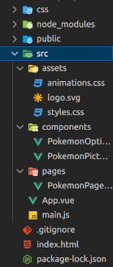
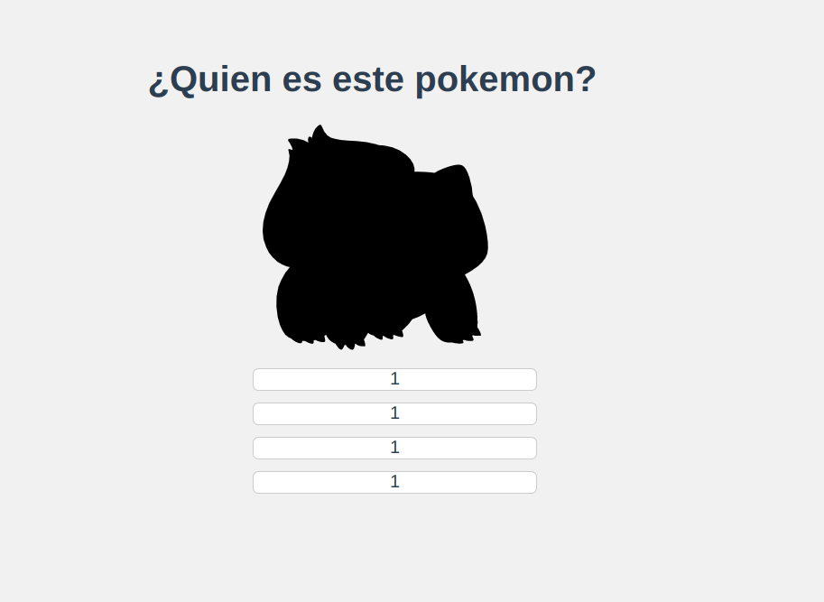

# Pokemon Game

En esta sección vamos a desarrollar un juego de pokémon, "adivina que pokémon es". Mostraremos un pokémon difuminado, y cuatro opciones a elegir, y el usuario tendrá que adivinar cual es.

El desarrollo del juego nos va a permitir aprender bastante sobre Vue y la comunicación entre componentes. El objetivo del desarrollo va a ser enfocarnos en:

- Mount

- Axios en Vue.js

- Emitir eventos

- Escuchar eventos personalizados

## Demo del objetivo final

En el siguiente enlace podemos ver un despligue de como se verá la aplicación una vez terminada:

- [Despliegue de Pokemosn Game](https://golden-blini-df8401.netlify.app/)

## Recursos para el desarrollo de la App

Algunos recursos que vamos a necesitar:

- [Axios](https://axios-http.com/es/docs/intro)
- [Enlace a la API pokeapi](https://pokeapi.co/)
- [CSS para la aplicación](assets/codigo-vue/Pokemon_css.zip)

## Inicio del proyecto

Comenzamos un nuevo proyecto Vue utilizando vite.

```
npm init vue@latest
```

A continuación nos descargamos [el zip con los arhivos css del proyecto](assets/codigo-vue/Pokemon_css.zip), añadimos los archivos animations.css y styles.css a la carpeta assets y los importamos en el main.js.

main.js

```
import { createApp } from 'vue'
import App from './App.vue'

import './assets/styles.css'
import './assets/animations.css'

createApp(App).mount('#app')
```

Ya tenemos todo listo para comenzar a trabajar en nuestro juego.

## Estructura del proyecto y componentes

Cuando estamos trabajando con un proyecto grande no se recomienda usar la estructura de carpetas por defecto. A medida que el proyecto crece será mas complejo tener localizados y controlados los diferentes elementos de la aplicación.
En ese caso se recomienda una estructura, como:

<center>

</center>

La aplicación que vamos a desarrollar es relativamente sencilla, tendrá solo 3 o 4 componentes, y no nos va a hacer falta una estructura compleja. Aún así tampoco tendría sentido implementar toda la aplicación en el App.vue, la segmentación en componentes siempre la va a hacer mas fácil de leer y mantener.

Vamos a utilizar la siguiente estructura:

<center>

</center>

Implementamos los componentes:

### Pokemon Page

Está será la página principal de la aplicación, aunque no vamos a usar el router y es nuestra única página está bien hacerla separada por si la aplicación crece y luego usamos un router.

PokemonPage.vue

```
<template>
  <div>
    <h1>¿Quien es este pokemon?</h1>


    <!-- TODO: Componente para mostrar la imagen del pokemon -->


    <!-- TODO: Componente para mostrar las opciones -->
  </div>
</template>

<script></script>

<style></style>
```

Lo mostramos en el App.vue:

App.vue

```
<template>
  <PokemonPage />
</template>

<script>
import PokemonPage from './pages/PokemonPage.vue'
export default { components: { PokemonPage } }
</script>

<style></style>
```

Nota. Añadimos a App.vue [el css que tenemos en el archivo App.css (zip con los arhivos css del proyecto](assets/codigo-vue/Pokemon_css.zip).

### PokemonPicture.vue

Este componente va a mostrar la imagen del pokemon que el usuario tiene que intentar adivinar.

```
<template>
  <h1>Pokemon Picture</h1>
</template>

<script>
export default {}
</script>

<style scoped></style>
```

### PokemonOptions.vue

Este componente tiene que mostrar una lista de pokemons para que el usuario elija la correcta.

```
<template>
  <h1>Opciones</h1>
</template>

<script>
export default {}
</script>

<style scoped></style>
```

Mostramos ambos componentes en el PokemonPage.vue:

PokemonPage.vue

```
<template>
  <div>
    <h1>¿Quien es este pokemon?</h1>

    <PokemonPicture />

    <PokemonOptions />
  </div>
</template>

<script>
import PokemonOptions from '../components/PokemonOptions.vue'
import PokemonPicture from '../components/PokemonPicture.vue'

export default { components: { PokemonOptions, PokemonPicture } }
</script>

<style></style>
```

## Diseño de los componentes

Vamos a realizar el diseño de los dos componentes, para posteriormente ya centrarnos en las funcionalidades.

### PokemonPicture.vue

De momento estamos haciendo la estructura, vamos a hacer que muestre la [imagen](https://raw.githubusercontent.com/PokeAPI/sprites/master/sprites/pokemon/other/dream-world/1.svg) de manera estática, y posteriormente la haremos dinámica. Le añadiremos tambien el css correspondiente.

```
<template>
  <div class="pokemon-container">
    
    <!--  -->
  </div>
</template>

<script>
export default {}
</script>

<style>
.pokemon-container {
  height: 200px;
  position: relative;
}

img {
  height: 200px;
  position: absolute;
  left: 50%;
  user-select: none;
  -moz-user-select: none;
  -ms-user-select: none;
  -webkit-user-drag: none;
  -webkit-user-select: none;

  transform: translateX(-50%);
}
.hidden-pokemon {
  filter: brightness(0);
}
</style>
```

### PokemonOptions.vue

En este componente vamos a implementar una lista con 4 elementos para posteriormente mostrar las opciones. Le añadiremos tambien el css correspondiente.

```
<template>
  <div class="options-container">
    <ul>
      <li>1</li>
      <li>1</li>
      <li>1</li>
      <li>1</li>
    </ul>
  </div>
</template>

<script>
export default {}
</script>

<style scoped>
ul {
  list-style-type: none;
}
li {
  background-color: white;
  border-radius: 5px;
  border: 1px solid rgba(0, 0, 0, 0.2);
  cursor: pointer;
  margin-bottom: 10px;
  width: 250px;
}

li:hover {
  background-color: rgba(0, 0, 0, 0.05);
}

.options-container {
  display: flex;
  justify-content: center;
}
</style>
```

Nuestro proyecto se verá algo, como:

<center>

</center>

Ya tenemos la estructura lista, ahora nos centraremos en la lógica de la aplicación.

## Funcionalidad de PokemonPicture

El componente tiene que recibir un pokemon, en concreto el id de un pokemon, y mostar la imagen de este.

PokemonPicture.vue

```
<template>
  <div class="pokemon-container">
    
    
  </div>
</template>

<script>
export default {
  props: {
    pokemonId: {
      type: Number,
      required: true,
    },
    showPokemon: {
      type: Boolean,
      required: true,
      default: false,
    },
  },
  computed: {
    imgSrc() {
      return `https://raw.githubusercontent.com/PokeAPI/sprites/master/sprites/pokemon/other/dream-world/${this.pokemonId}.svg`
    },
  },
}
</script>

<style>
.pokemon-container {
  height: 200px;
  position: relative;
}

img {
  height: 200px;
  position: absolute;
  left: 50%;
  user-select: none;
  -moz-user-select: none;
  -ms-user-select: none;
  -webkit-user-drag: none;
  -webkit-user-select: none;

  transform: translateX(-50%);
}
.hidden-pokemon {
  filter: brightness(0);
}
</style>
```

PokemonPage.vue

```
<template>
  <div>
    <h1>¿Quien es este pokemon?</h1>

    <PokemonPicture :pokemonId="151" :showPokemon="false" />

    <PokemonOptions />
  </div>
</template>

<script>
import PokemonOptions from '../components/PokemonOptions.vue'
import PokemonPicture from '../components/PokemonPicture.vue'

export default { components: { PokemonOptions, PokemonPicture } }
</script>

<style></style>
```

## Lógica de los nombres de los pokémons

El componente PokemonOptions debería de recibir un array con los 4 pokemons que tiene que mostrar en las opciones. Para evitar pomer toda la lógica en el componente PokemonPage vamos a crearnos una carpeta helpers y dentro un archivo getPokemonOptions.js.

getPokemonOptions.js

```
const getPokemons = () => {
  const pokemosArr = Array.from(Array(650))
  return pokemosArr.map((arg, index) => index + 1)
}

const getPokemonOptions = () => {
  const mixedPokemons = getPokemons().sort(() => Math.random() - 0.5)
  getPokemonName(mixedPokemons.splice(0, 4))
}

const getPokemonName = ([a, b, c, d] = []) => {
  console.log(a, b, c, d)
}

export default getPokemonOptions
```

PokemonPage.vue

```
<template>
  <div>
    <h1>¿Quien es este pokemon?</h1>

    <PokemonPicture :pokemonId="151" :showPokemon="false" />

    <PokemonOptions />
  </div>
</template>

<script>
import PokemonOptions from '../components/PokemonOptions.vue'
import PokemonPicture from '../components/PokemonPicture.vue'
import getPokemonOptions from '@/helpers/getPokemonOptions'

console.log(getPokemonOptions())

export default { components: { PokemonOptions, PokemonPicture } }
</script>

<style></style>
```

## Obtener nombres de los 4 pokémons

Ya tenemos los id de los 4 pokemons que queremos mostrar, ahora tenemos que llamar a la API y obtener los datos de esos pokemons.

### Axios

Para hacer las peticiones vamos a usar axios, vamos a instalar la librería:

```
npm install axios
```

### HTTP request

Nos creamos una nueva carpeta que llamaremos "api", y un archivo pokemonAPI.js y en el haremos la configuración de axios.

pokemonAPI.js

```
import axios from 'axios'

const pokemonAPI = axios.create({
  baseURL: 'https://pokeapi.co/api/v2/pokemon',
})

export default pokemonAPI
```

getPokemonOptions.js

```
import pokemonAPI from '../api/pokemonAPI'

const getPokemons = () => {
  const pokemosArr = Array.from(Array(650))
  return pokemosArr.map((arg, index) => index + 1)
}

const getPokemonOptions = async () => {
  const mixedPokemons = getPokemons().sort(() => Math.random() - 0.5)
  const pokemons = await getPokemonNames(mixedPokemons.splice(0, 4))
  return pokemons
}

const getPokemonNames = async ([a, b, c, d] = []) => {
  const promiseArr = [
    pokemonAPI.get(`/${a}`),
    pokemonAPI.get(`/${b}`),
    pokemonAPI.get(`/${c}`),
    pokemonAPI.get(`/${d}`),
  ]
  const [pok1, pok2, pok3, pok4] = await Promise.all(promiseArr)
  return [
    { name: pok1.data.name, id: pok1.data.id },
    { name: pok2.data.name, id: pok2.data.id },
    { name: pok3.data.name, id: pok3.data.id },
    { name: pok4.data.name, id: pok4.data.id },
  ]
}

export default getPokemonOptions
```

## Mostrar las opciones posibles

Una vez que ya hemos obtenido los datos de los 4 pokemons, vamos a pintar los nombres en las opciones.

PokemonPage.vue

```
<template>
  <div>
    <h1>¿Quien es este pokemon?</h1>

    <PokemonPicture :pokemonId="151" :showPokemon="false" />

    <PokemonOptions :pokemons="pokemonsArr" />
  </div>
</template>

<script>
import PokemonOptions from '../components/PokemonOptions.vue'
import PokemonPicture from '../components/PokemonPicture.vue'
import getPokemonOptions from '@/helpers/getPokemonOptions'

export default {
  components: { PokemonOptions, PokemonPicture },
  data() {
    return {
      pokemonsArr: [],
    }
  },
  methods: {
    async mixPokemonArray() {
      this.pokemonsArr = await getPokemonOptions()
    },
  },
  mounted() {
    this.mixPokemonArray()
  },
}
</script>

<style></style>
```

PokemonOptions.vue

```
<template>
  <div class="options-container">
    <ul>
      <li v-for="pokemon in pokemons" :key="pokemon.id">{{ pokemon.name }}</li>
    </ul>
  </div>
</template>

<script>
export default {
  props: {
    pokemons: {
      type: Array,
      required: true,
    },
  },
}
</script>

<style scoped>
ul {
  list-style-type: none;
}
li {
  background-color: white;
  border-radius: 5px;
  border: 1px solid rgba(0, 0, 0, 0.2);
  cursor: pointer;
  margin-bottom: 10px;
  width: 250px;
}

li:hover {
  background-color: rgba(0, 0, 0, 0.05);
}

.options-container {
  display: flex;
  justify-content: center;
}
</style>
```

## Seleccionar un pokémon aleatoriamente

Ya estamos mostrando los nombres de los pokemons, ahora tenemos que mostrar la imagen de uno de ellos.

PokemonPage.vue

```
<template>
  <h1 v-if="!pokemon">Espere por favor...</h1>
  <div v-else="pokemon">
    <h1>¿Quien es este pokemon?</h1>

    <PokemonPicture :pokemonId="pokemon.id" :showPokemon="false" />

    <PokemonOptions :pokemons="pokemonsArr" />
  </div>
</template>

<script>
import PokemonOptions from '../components/PokemonOptions.vue'
import PokemonPicture from '../components/PokemonPicture.vue'
import getPokemonOptions from '@/helpers/getPokemonOptions'

export default {
  components: { PokemonOptions, PokemonPicture },
  data() {
    return {
      pokemonsArr: [],
      pokemon: null,
    }
  },
  methods: {
    async mixPokemonArray() {
      this.pokemonsArr = await getPokemonOptions()
      const rndInt = Math.floor(Math.random() * 4)
      this.pokemon = this.pokemonsArr[rndInt]
    },
  },
  mounted() {
    this.mixPokemonArray()
  },
}
</script>

<style></style>
```

Ahora vamos a hacer que e pokemon se "descubra" cuando el usuario haga click en una de las opciones.

PokemonPage.vue

```
<template>
  <h1 v-if="!pokemon">Espere por favor...</h1>
  <!-- <div v-if="pokemon"> -->
  <div v-else="pokemon">
    <h1>¿Quien es este pokemon?</h1>

    <PokemonPicture :pokemonId="pokemon.id" :showPokemon="showPokemon" />

    <PokemonOptions :pokemons="pokemonsArr" />
  </div>
</template>

<script>
import PokemonOptions from '../components/PokemonOptions.vue'
import PokemonPicture from '../components/PokemonPicture.vue'
import getPokemonOptions from '@/helpers/getPokemonOptions'

export default {
  components: { PokemonOptions, PokemonPicture },
  data() {
    return {
      pokemonsArr: [],
      pokemon: null,
      showPokemon: false,
    }
  },
  methods: {
    async mixPokemonArray() {
      this.pokemonsArr = await getPokemonOptions()
      const rndInt = Math.floor(Math.random() * 4)
      this.pokemon = this.pokemonsArr[rndInt]
    },
  },
  mounted() {
    this.mixPokemonArray()
  },
}
</script>

<style></style>
```

## Emit - Emitir eventos

En este apartado tenemo que hacer que el componente hijo opciones "emita" cual es la opción en la que el usuario ha hecho click. Para ello vamos a hacer uso de los [custom events](https://v2.vuejs.org/v2/guide/components-custom-events.html) de vue.

PokemonOptions.vue

```
<template>
  <div class="options-container">
    <ul>
      <li
        v-for="pokemon in pokemons"
        :key="pokemon.id"
        @click="$emit('selection', pokemon.id)">
        {{ pokemon.name }}
      </li>
    </ul>
  </div>
</template>

<script>
export default {
  props: {
    pokemons: {
      type: Array,
      required: true,
    },
  },
}
</script>

<style scoped>
ul {
  list-style-type: none;
}
li {
  background-color: white;
  border-radius: 5px;
  border: 1px solid rgba(0, 0, 0, 0.2);
  cursor: pointer;
  margin-bottom: 10px;
  width: 250px;
}

li:hover {
  background-color: rgba(0, 0, 0, 0.05);
}

.options-container {
  display: flex;
  justify-content: center;
}
</style>
```

PokemonPage.vue

```
<template>
  <h1 v-if="!pokemon">Espere por favor...</h1>
  <div v-else="pokemon">
    <h1>¿Quien es este pokemon?</h1>

    <PokemonPicture :pokemonId="pokemon.id" :showPokemon="showPokemon" />

    <PokemonOptions :pokemons="pokemonsArr" @selection="checkAnswer" />
  </div>
</template>

<script>
import PokemonOptions from '../components/PokemonOptions.vue'
import PokemonPicture from '../components/PokemonPicture.vue'
import getPokemonOptions from '@/helpers/getPokemonOptions'

export default {
  components: { PokemonOptions, PokemonPicture },
  data() {
    return {
      pokemonsArr: [],
      pokemon: null,
      showPokemon: false,
    }
  },
  methods: {
    async mixPokemonArray() {
      this.pokemonsArr = await getPokemonOptions()
      const rndInt = Math.floor(Math.random() * 4)
      this.pokemon = this.pokemonsArr[rndInt]
    },
    checkAnswer(selectedId) {
      console.log(pokemonId)
      this.showPokemon = true
    },
  },
  mounted() {
    this.mixPokemonArray()
  },
}
</script>

<style></style>
```

## Resultado y reinicio de juego

Ya estamos finalizando el proyecto, nos faltan los últimos detalles. Por ejemplo, que muestre un mensaje cuando el usuario acierta o falla.

PokemonOptions.vue

```
<template>
  <h1 v-if="!pokemon">Espere por favor...</h1>
  <div v-else="pokemon">
    <h1>¿Quien es este pokemon?</h1>

    <PokemonPicture :pokemonId="pokemon.id" :showPokemon="showPokemon" />

    <PokemonOptions :pokemons="pokemonsArr" @selection="checkAnswer" />

    <template v-if="showAnswer">
      <h2 class="fade-in">{{ message }}</h2>
      <button @click="newGame">Jugar de nuevo</button>
    </template>
  </div>
</template>

<script>
import PokemonOptions from '../components/PokemonOptions.vue'
import PokemonPicture from '../components/PokemonPicture.vue'
import getPokemonOptions from '@/helpers/getPokemonOptions'

export default {
  components: { PokemonOptions, PokemonPicture },
  data() {
    return {
      pokemonsArr: [],
      pokemon: null,
      showPokemon: false,
      showAnswer: false,
      message: '',
    }
  },
  methods: {
    async mixPokemonArray() {
      this.pokemonsArr = await getPokemonOptions()
      const rndInt = Math.floor(Math.random() * 4)
      this.pokemon = this.pokemonsArr[rndInt]
    },
    checkAnswer(selectedId) {
      this.showPokemon = true
      this.showAnswer = true

      if (selectedId === this.pokemon.id) {
        this.message = `Correcto, ${this.pokemon.name}`
      } else {
        this.message = `Ups, era ${this.pokemon.name}`
      }
    },
    newGame() {
      ;(this.showPokemon = false),
        (this.showAnswer = false),
        (this.pokemonsArr = []),
        this.mixPokemonArray(),
        (this.pokemon = null)
    },
  },
  mounted() {
    this.mixPokemonArray()
  },
}
</script>

<style></style>
```

## Desplegar nuestro juego en producción

```
npm run build
npm run preview
```

## Código fuente de la sección

En [este enlace](assets/codigo-vue/PokemonGame.zip) encontraréis el código fuente de la aplicación finalizada.
