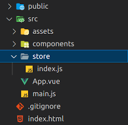
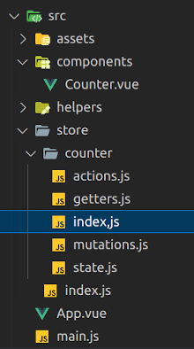

# Vuex


>> **IMPORTANT. Pinia is now the new default**

>> La librería oficial para la gestión de estado en Vue ha cambiado a Pinia. Pinia tiene casi la misma API exacta o mejorada que Vuex 5, descrita en el RFC de Vuex 5. Podrías simplemente considerar a Pinia como Vuex 5 con un nombre diferente. Pinia también funciona con Vue 2.x.

>> Vuex 3 y 4 seguirán siendo mantenidos. Sin embargo, es poco probable que se añadan nuevas funcionalidades. Vuex y Pinia pueden ser instalados en el mismo proyecto. Si estás migrando una aplicación existente de Vuex a Pinia, podría ser una opción adecuada. Sin embargo, si estás planeando comenzar un nuevo proyecto, recomendamos altamente usar Pinia en su lugar.


## Introducción a la sección

Esta sección esta dedicada a tener una introducción a [Vuex](https://vuex.vuejs.org/), como gestor de estado global de nuestra aplicación.

Los objetivos de la sección son enfocarnos en:

- ¿Qué es Vuex?
- ¿Qué problema resuelve Vuex?
- Actions
- Getters
- Mutations
- State
- Módulos
- Segmentación
- Vuex DevTools

Esta sección es muy importante para comprender Vuex, el cual es un gestor de estado muy popular cuando sabemos que las aplicaciones serán de mediana a gran escala.

## Introducción a Vuex

[Vuex](https://vuex.vuejs.org/) sirve como un almacén centralizado para todos los componentes de una aplicación, con reglas que garantizan que el estado solo se puede modificar de una manera predecible.

La idea principal es generar un estado global para que todos los componentes puedan acceder a la información, así también podemos tener mutaciones, acciones y getters.

<center>

</center>

### ¿Cuándo debo usarlo?

Si nuestra aplicación es simple, lo más probable es que un almacen de estados no aporte una complejidad innecesaria. Un simple patrón de tienda puede ser todo lo que necesitas. Pero si construyes una SPA de mediana a gran escala, lo más probable es que nos encontremos con situaciones que te hagan pensar en cómo manejar mejor el estado fuera de tus componentes Vue, y Vuex será el siguiente paso natural.

Hay una buena cita de Dan Abramov, el autor de Redux:

> "Las librerías de flujo son como las gafas: sabrás cuándo las necesitas"

## Inicio de proyecto

Comenzamos un nuevo proyecto Vue utilizando vite.

```
npm init vue@latest
```

```
Vue.js - The Progressive JavaScript Framework

✔ Project name: … Vuex
✔ Package name: … Vuex
✔ Add TypeScript? … No / Yes
✔ Add JSX Support? … No / Yes
✔ Add Vue Router for Single Page Application development? … No / Yes
✔ Add Pinia for state management? … No / Yes
✔ Add Vitest for Unit Testing? … No / Yes
✔ Add an End-to-End Testing Solution? › No
✔ Add ESLint for code quality? … No / Yes

Scaffolding project in /xxx/xxx/Vuex...

Done. Now run:

  cd Vuex
  npm install
  npm run dev

```

Una vez que tenemos creado el proyecto, eliminamos los elementos que genera por defecto y no vamos a utilizar, componentes, archivos css, etc....

## Instalación manual de Vuex

En la página oficial de Vue tenemos las [diferentes formas de instalar Vuex](https://vuex.vuejs.org/installation.html#installation) en nuestra aplicación. Nosotros vamos a usar npm:

```
npm install vuex@next --save
```

## Configuramos nuestro primer Store

Preparamos la estructura de carpetas y archivos para usar Vuex, para ello creamos una carpeta store y un archivo para almacenar nuestro store.

<center>

</center>

store/index.js

```
import { createStore } from 'vuex'

export default createStore({
  state: {
    count: 1,
  },
})
```

main.js

```
import { createApp } from 'vue'
import App from './App.vue'
import store from './store'

import './assets/main.css'

createApp(App).use(store).mount('#app')
```

## Leer el state reactivo

Hay ver diferentes formas de leer las propiedades que se encuentran en el state del store, vamos a ver algunas de ellas. Para ver las diferentes formas creamos un componente counter.

### Direct access

Counter.vue

```
<template>
  <div>
    <h1>Counter - Vuex</h1>
    <h2>Direct Access - {{ $store.state.count }}</h2>
  </div>
</template>

<script>
export default {}
</script>

<style scoped></style>
```

### Propiedad computada

Podemos almacenarlo en una propiedad computada.

Counter.vue

```
<template>
  <div>
    <h1>Counter - Vuex</h1>
    <h2>Direct Access - {{ $store.state.count }}</h2>
    <h2>Conmputed property - {{ countComputed }}</h2>
  </div>
</template>

<script>
export default {
  computed: {
    countComputed() {
      return this.$store.state.count
    },
  },
}
</script>

<style scoped></style>
```

### mapState

El [helper mapState](https://vuex.vuejs.org/guide/state.html#the-mapstate-helper) genera funciones getter computadas.

Counter.vue

```
<template>
  <div>
    <h1>Counter - Vuex</h1>
    <h2>Direct Access - {{ $store.state.count }}</h2>
    <h2>mapState - {{ count }}</h2>
  </div>
</template>

<script>
import { mapState } from 'vuex'
export default {
  computed: mapState(['count']),
}
</script>

<style scoped></style>
```

Conservando las propiedades conmutadas:

Counter.vue

```
<template>
  <div>
    <h1>Counter - Vuex</h1>
    <h2>Direct Access - {{ $store.state.count }}</h2>
    <!-- <h2>Conmputed property - {{ countComputed }}</h2> -->
    <h2>mapState - {{ count }} - {{ lastMutation }}</h2>
  </div>
</template>

<script>
import { mapState } from 'vuex'
export default {
  computed: {
    countComputed() {
      return this.$store.state.count
    },
    // ...mapState(['count']),
    ...mapState({
      count: (state) => state.count,
      lastMutation: (state) => state.lastMutation,
    }),
  },
}
</script>

<style scoped></style>
```

store/index.js

```
import { createStore } from 'vuex'

export default createStore({
  state: {
    count: 1,
    lastMutation: 'none',
  },
})
```

## Mutations

La única forma de cambiar de estado en una store Vuex es a través de una [mutación](https://vuex.vuejs.org/guide/mutations.html#mutations).

store/index.js

```
import { createStore } from 'vuex'

export default createStore({
  state: {
    count: 1,
    lastMutation: 'none',
  },
  mutations: {
    increment(state) {
      state.count++
      state.lastMutation = 'increment'
    },
    // Mutación recibiendo un argumento
    incrementBy(state, value) {
      state.count += value
      state.lastMutation = 'incrementBy'
    },
  },
})

```

Counter.vue

```
<template>
  <div>
    <h1>Counter - Vuex</h1>
    <h2>Direct Access - {{ $store.state.count }}</h2>
    <!-- <h2>Conmputed property - {{ countComputed }}</h2> -->
    <h2>mapState - {{ count }} - {{ lastMutation }}</h2>
    <hr />
    <button @click="increment">+1</button>
    <button @click="incrementBy">+5</button>
    <button>Random</button>
  </div>
</template>

<script>
import { mapState } from 'vuex'
export default {
  computed: {
    countComputed() {
      return this.$store.state.count
    },
    // ...mapState(['count']),
    ...mapState({
      count: (state) => state.count,
      lastMutation: (state) => state.lastMutation,
    }),
  },
  // Metodos
  methods: {
    increment() {
      this.$store.commit('increment')
    },
    incrementBy() {
      this.$store.commit('incrementBy', 5)
    },
  },
}
</script>

<style scoped></style>
```

Nota. Las mutations NO pueden ser asíncronas.

## Actions

Las acciones son similares a las mutaciones, las diferencias son que:

- En lugar de mutar el estado, las acciones cometen mutaciones.
- Las acciones pueden contener ser asincronas.

Es habitual dispararlas para comprobar algo en el back y cuando recibimos la respuesta disparamos el commit de la mutación.

Para probar las actions nos vamos a crear un helper que nos devuelva un número aleatorio, usaremos una promesa para hacerlo asíncrono.

getRandomInt.js

```
const getRandomInt = () => {
  return new Promise((resolve) => {
    const rndInt = Math.floor(Math.random() * 20 + 1)
    setTimeout(() => {
      resolve(rndInt)
    }, 1000)
  })
}

export default getRandomInt
```

store/index.js

```
import { createStore } from 'vuex'
import getRandomInt from '../helpers/getRandomInt'

export default createStore({
  state: {
    count: 1,
    lastMutation: 'none',
  },

  // **** Mutations ****
  mutations: {
    increment(state) {
      state.count++
      state.lastMutation = 'increment'
    },
    incrementBy(state, value) {
      state.count += value
      state.lastMutation = 'incrementBy ' + value
    },
  },

  // **** Aactions ****
  actions: {
    async incrementRandomInt(context) {
      const randomInt = await getRandomInt()

      context.commit('incrementBy', randomInt)
    },
  },
})
```

Counter.vue

```
<template>
  <div>
    <h1>Counter - Vuex</h1>
    <h2>Direct Access - {{ $store.state.count }}</h2>
    <!-- <h2>Conmputed property - {{ countComputed }}</h2> -->
    <h2>mapState - {{ count }} - {{ lastMutation }}</h2>
    <hr />
    <button @click="increment">+1</button>
    <button @click="incrementBy">+5</button>
    <button @click="incrementRandomInt">Random</button>
  </div>
</template>

<script>
import { mapState } from 'vuex'
export default {
  computed: {
    countComputed() {
      return this.$store.state.count
    },
    // ...mapState(['count']),
    ...mapState({
      count: (state) => state.count,
      lastMutation: (state) => state.lastMutation,
    }),
  },
  // Metodos
  methods: {
    increment() {
      this.$store.commit('increment')
    },
    incrementBy() {
      this.$store.commit('incrementBy', 5)
    },
    incrementRandomInt() {
      this.$store.dispatch('incrementRandomInt')
    },
  },
}
</script>

<style scoped></style>
```

## mapActions

Como hemos visto anteriormente, podemos disparar acciones desde los componentes con this.$store.dispatch('xxx'), otra opción sería usar el helper [mapActions](https://vuex.vuejs.org/guide/actions.html#dispatching-actions-in-components) que asigna métodos de componentes a llamadas store.dispatch.

Counter.vue

```
<template>
  <div>
    <h1>Counter - Vuex</h1>
    <h2>Direct Access - {{ $store.state.count }}</h2>
    <!-- <h2>Conmputed property - {{ countComputed }}</h2> -->
    <h2>mapState - {{ count }} - {{ lastMutation }}</h2>
    <hr />
    <button @click="increment">+1</button>
    <button @click="incrementBy">+5</button>
    <!-- <button @click="incrementRandomInt">Random</button> -->
    <button @click="randomInt">Random</button>
  </div>
</template>

<script>
import { mapState, mapActions } from 'vuex'
export default {
  computed: {
    countComputed() {
      return this.$store.state.count
    },
    ...mapState({
      count: (state) => state.count,
      lastMutation: (state) => state.lastMutation,
    }),
  },

  //  **** Metodos ****
  methods: {
    increment() {
      this.$store.commit('increment')
    },
    incrementBy() {
      this.$store.commit('incrementBy', 5)
    },
    // incrementRandomInt() {
    //   this.$store.dispatch('incrementRandomInt')
    // },
    // ...mapActions(['incrementRandomInt']),
    ...mapActions({
      randomInt: 'incrementRandomInt',
    }),
  },
}
</script>

<style scoped></style>
```

## Bloquear botón mientras una acción trabaja

Cuando hacemos click en el botón solicitamos un número aleatorio, si durante el tiempo que tarda en responder le damos mas veces, se van a encadenar las llamadas. Vamos a deshabilitar el botón hasta que no tengamos respuesta.

store/index.js

```
import { createStore } from 'vuex'
import getRandomInt from '../helpers/getRandomInt'

export default createStore({
  state: {
    count: 1,
    lastMutation: 'none',
    isLoading: false,
  },

  // **** Mutations ****
  mutations: {
    increment(state) {
      state.count++
      state.lastMutation = 'increment'
    },
    incrementBy(state, value) {
      state.count += value
      state.lastMutation = 'incrementBy ' + value
    },
    setLoading(state, value) {
      state.isLoading = value
      state.lastMutation = 'setLoading ' + value
    },
  },

  // **** Actions ****
  actions: {
    async incrementRandomInt(context) {
      context.commit('setLoading', true)
      const randomInt = await getRandomInt()

      context.commit('incrementBy', randomInt)
      context.commit('setLoading', false)
    },
  },
})
```

Counter.vue

```
<template>
  <div>
    <h1>Counter - Vuex</h1>
    <h2>Direct Access - {{ $store.state.count }}</h2>
    <h2>mapState - {{ count }} - {{ lastMutation }}</h2>
    <hr />
    <button @click="increment">+1</button>
    <button @click="incrementBy">+5</button>
    <button @click="randomInt" :disabled="isLoading">Random</button>
  </div>
</template>

<script>
import { mapState, mapActions } from 'vuex'
export default {
  computed: {
    countComputed() {
      return this.$store.state.count
    },
    ...mapState({
      count: (state) => state.count,
      lastMutation: (state) => state.lastMutation,
      isLoading: (state) => state.isLoading,
    }),
  },

  //  **** Métodos ****
  methods: {
    increment() {
      this.$store.commit('increment')
    },
    incrementBy() {
      this.$store.commit('incrementBy', 5)
    },
    ...mapActions({
      randomInt: 'incrementRandomInt',
    }),
  },
}
</script>

<style scoped></style>
```

## Getters

Los [getters](https://vuex.vuejs.org/guide/getters.html#getters) podríamos decir que tienen un comportamiento similar a las propiedades computadas.

store/index.js

```
import { createStore } from 'vuex'
import getRandomInt from '../helpers/getRandomInt'

export default createStore({
  state: {
    count: 1,
    lastMutation: 'none',
    isLoading: false,
  },

  // **** Mutations ****
  mutations: {
    increment(state) {
      state.count++
      state.lastMutation = 'increment'
    },
    incrementBy(state, value) {
      state.count += value
      state.lastMutation = 'incrementBy ' + value
    },
    setLoading(state, value) {
      state.isLoading = value
      state.lastMutation = 'setLoading ' + value
    },
  },

  // **** Actions ****
  actions: {
    async incrementRandomInt(context) {
      this.commit('setLoading', true)
      const randomInt = await getRandomInt()

      context.commit('incrementBy', randomInt)
      context.commit('setLoading', false)
    },
  },

  //  **** Getters ****
  getters: {
    squareCount(state) {
      return state.count * state.count
    },
  },
})
```

Counter.vue

```
<template>
  <div>
    <h1>Counter - Vuex</h1>
    <h2>Direct Access - {{ $store.state.count }}</h2>
    <h2>mapState - {{ count }} - {{ lastMutation }}</h2>
    <hr />
    <button @click="increment">+1</button>
    <button @click="incrementBy">+5</button>
    <button @click="randomInt" :disabled="isLoading">Random</button>

    <h2>Direct Getter: {{ $store.getters.squareCount }}</h2>
  </div>
</template>

<script>
import { mapState, mapActions } from 'vuex'
export default {
  computed: {
    countComputed() {
      return this.$store.state.count
    },
    ...mapState({
      count: (state) => state.count,
      lastMutation: (state) => state.lastMutation,
      isLoading: (state) => state.isLoading,
    }),
  },

  //  **** Métodos ****
  methods: {
    increment() {
      this.$store.commit('increment')
    },
    incrementBy() {
      this.$store.commit('incrementBy', 5)
    },
    ...mapActions({
      randomInt: 'incrementRandomInt',
    }),
  },
}
</script>

<style scoped></style>
```

## Modules

Debido al uso de un único árbol de estados, todos los estados de nuestra aplicación están contenidos dentro de un gran objeto. Sin embargo, a medida que nuestra aplicación crezca, el almacen puede volverse un caos.

Para solucionar eso, Vuex nos permite dividir nuestro almacén en módulos. Cada módulo puede contener su propio estado, mutaciones, acciones, getters, e incluso módulos anidados.

Vamos a crear una carpeta nueva para el módulo del store y un archivo index.js en ella.

<center>

</center>

store/index.js

```
import { createStore } from 'vuex'
import counterStore from './counter/index,js'

export default createStore({
  modules: {
    counter: counterStore,
  },
})
```

store/counter/index.js

```
import getRandomInt from '../../helpers/getRandomInt'

const counterStore = {
  state: () => ({
    count: 1,
    lastMutation: 'none',
    isLoading: false,
  }),

  // **** Mutations ****
  mutations: {
    increment(state) {
      state.count++
      state.lastMutation = 'increment'
    },
    incrementBy(state, value) {
      state.count += value
      state.lastMutation = 'incrementBy ' + value
    },
    setLoading(state, value) {
      state.isLoading = value
      state.lastMutation = 'setLoading ' + value
    },
  },

  // **** Actions ****
  actions: {
    async incrementRandomInt(context) {
      this.commit('setLoading', true)
      const randomInt = await getRandomInt()

      context.commit('incrementBy', randomInt)
      context.commit('setLoading', false)
    },
  },

  //  **** Getters ****
  getters: {
    squareCount(state) {
      return state.count * state.count
    },
  },
}

export default counterStore
```

Vemos que algunas cosa fallan, básicamente todo lo que usa la notación del tipo direct access, $store.state.count, ya que ahora en nuestro store no tenemos directamente almacenados esos states. Si que funcionan las que tenemos asociadas con los maps.

## Actions, Getters, Mutations, State desde un módulo

Si que nos está funcionando el direct getter, $store.getters.squareCount, y esto podría generar poblemas, ya que si nos despistamos podríamos tener dos getters con el mismo nombre en módulos diferentes y provocar un error.

Si queremos evitar eso y que nuestros módulos sean más autónomos o reutilizables, podemos marcar nuestros strores como espacios de nombres independientes con la propiedad namespace. Cuando se registra el módulo, todos sus getters, acciones y mutaciones se asignarán automáticamente a un espacio de nombres en función de la ruta en la que se registró el módulo.

store/counter/index.js

```
import getRandomInt from '../../helpers/getRandomInt'

const counterStore = {

  namespaced: true,

  state: () => ({
    count: 1,
    lastMutation: 'none',
    isLoading: false,
  }),

  // **** Mutations ****
  mutations: {
    increment(state) {
      state.count++
      state.lastMutation = 'increment'
    },
    incrementBy(state, value) {
      state.count += value
      state.lastMutation = 'incrementBy ' + value
    },
    setLoading(state, value) {
      state.isLoading = value
      state.lastMutation = 'setLoading ' + value
    },
  },

  // **** Actions ****
  actions: {
    async incrementRandomInt(context) {
      this.commit('setLoading', true)
      const randomInt = await getRandomInt()

      context.commit('incrementBy', randomInt)
      context.commit('setLoading', false)
    },
  },

  //  **** Getters ****
  getters: {
    squareCount(state) {
      return state.count * state.count
    },
  },
}

export default counterStore
```

Ahora esto, $store.getters.squareCount, ya no nos funciona, aunque tanbien han dejado de funcionar otras opciones. Tenemos que hacer unos ajustes para adecuar la aplicación al nuevo espacio de nombres.

Counter.js

```
<template>
  <div>
    <h1>Counter - Vuex</h1>
    <h2>Direct Access - {{ $store.state.counter.count }}</h2>
    <h2>Computed: {{ countComputed }}</h2>
    <h2>mapState - {{ count }} - {{ lastMutation }}</h2>

    <hr />

    <button @click="increment">+1</button>
    <button @click="incrementBy">+5</button>
    <!-- <button @click="randomInt" :disabled="isLoading">Random</button> -->
    <button @click="incrementRandomInt" :disabled="isLoading">Random</button>

    <h2>Direct getter: {{ $store.getters['counter/squareCount'] }}</h2>
  </div>
</template>

<script>
import { mapState, mapActions } from 'vuex'
export default {
  computed: {
    countComputed() {
      return this.$store.state.counter.count
    },
    ...mapState('counter', ['count', 'lastMutation', 'isLoading']),
    // ...mapState({
    //   count: (state) => state.count,
    //   lastMutation: (state) => state.lastMutation,
    //   isLoading: (state) => state.isLoading,
    // }),
  },

  //  **** Métodos ****
  methods: {
    increment() {
      this.$store.commit('counter/increment')
    },
    incrementBy() {
      this.$store.commit('counter/incrementBy', 5)
    },
    ...mapActions('counter', ['incrementRandomInt']),
    // ...mapActions('counter', {
    //   randomInt: 'incrementRandomInt',
    // }),
  },
}
</script>

<style scoped></style>
```

## Separar módulo en archivos independientes

Lo último que vamos a hacer es refactorizar un poco el código, dividir cada una de las "piezas" del counter store en archivos idependientes.

Preparamos la estructura de archivos, vamos a crear un archivo .js por cada uno de los elementos que vamos a separar, actions, getters, mutations, y state.

<center>

</center>

store/counter/state.js

```
export default () => ({
  count: 1,
  lastMutation: 'none',
  isLoading: false,
})
```

store/counter/mutations.js

```
export const increment = (state) => {
  state.count++
  state.lastMutation = 'increment'
}
export const incrementBy = (state, value) => {
  state.count += value
  state.lastMutation = 'incrementBy ' + value
}
export const setLoading = (state, value) => {
  state.isLoading = value
  state.lastMutation = 'setLoading ' + value
}
```

store/counter/actions.js

```
import getRandomInt from '../../helpers/getRandomInt'

export const incrementRandomInt = async ({ commit }) => {
  commit('setLoading', true)
  const randomInt = await getRandomInt()

  commit('incrementBy', randomInt)
  commit('setLoading', false)
}
```

store/counter/getters.js

```
export const squareCount = (state) => {
  return state.count * state.count
}
```

store/counter/index.js

```
import state from './state'
import * as mutations from './mutations'
import * as actions from './actions'
import * as getters from './getters'

const counterStore = {
  namespaced: true,
  // state: state,
  state,
  mutations,
  actions,
  getters,
}

export default counterStore
```

## Código fuente de la sección

En [este enlace](assets/codigo-vue/Vuex.zip) encontraréis el código fuente de la aplicación finalizada.
