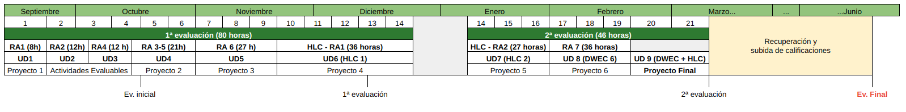

# Desarrollo Web en Entorno Cliente

---

## Título: Desarrollo de Aplicaciones Web

**Nivel**: Formación Profesional de Grado Superior.

**Duración**: 2000 horas.

**Familia Profesional**: Informática y Comunicaciones.

**Referente europeo**: CINE-5b (Clasificación Internacional Normalizada de la Educación).

* *Real Decreto 686/2010, de 20 de mayo*
* *Orden de 16 de junio de 2011*
* *Real Decreto 405/2023, de 29 de mayo*

---

## Módulo: Desarrollo de Aplicaciones Web (0612)

**Curso**: 2º DAW

**Sesiones DWEC**: 3 + 3 horas → 6 horas/semana (126 horas)

**Sesiones HLC**: 3 horas → 3 horas/semana (63 horas)

**Duración**: 189 horas aprox. → 21 semanas

**Evaluaciones parciales**: 2

**Evaluaciones finales**: 2

---

## Objetivos generales

Note:

f) Seleccionar lenguajes, objetos y herramientas, interpretando las especificaciones para desarrollar aplicaciones Web con acceso a bases de datos.

g) Utilizar lenguajes, objetos y herramientas, interpretando las especificaciones para desarrollar aplicaciones Web con acceso a bases de datos.

i) Utilizar lenguajes de marcas y estándares Web, asumiendo el manual de estilo, para desarrollar interfaces en aplicaciones Web.

q) Programar y realizar actividades para gestionar el mantenimiento de los recursos informáticos.

r) Analizar y utilizar los recursos y oportunidades de aprendizaje relacionadas con la evolución científica, tecnológica y organizativa del sector y las tecnologías de la información y la comunicación, para mantener el espíritu de actualización y adaptarse a nuevas situaciones laborales y personales.

---

## Competencias profesionales, personales y sociales

Note:

a) Configurar y explotar sistemas informáticos, adaptando la configuración lógica del sistema según las necesidades de uso y los criterios establecidos.

e) Desarrollar aplicaciones Web con acceso a bases de datos utilizando lenguajes, objetos de acceso y herramientas de mapeo adecuados a las especificaciones.

k) Desarrollar servicios para integrar sus funciones en otras aplicaciones Web, asegurando su funcionalidad.

n) Elaborar y mantener la documentación de los procesos de desarrollo, utilizando herramientas de generación de documentación y control de versiones.

p) Adaptarse a las nuevas situaciones laborales, manteniendo actualizados los conocimientos científicos, técnicos y tecnológicos relativos a su entorno profesional, gestionando su formación y los recursos existentes en el aprendizaje a lo largo de la vida y utilizando las tecnologías de la información y la comunicación.

r) Organizar y coordinar equipos de trabajo, supervisando el desarrollo del mismo, con responsabilidad, manteniendo relaciones fluidas y asumiendo el liderazgo, así como, aportando soluciones a los conflictos grupales que se presentan.

---

## Distribución horaria - Grupo A

|          | **Lunes** | **Martes** | **Miércoles** | **Jueves** | **Viernes** |
|-------------------|-----------|------------|---------------|------------|------------|
| **08:00 - 09:00** |   DWEC    |            |     DWEC      |            |    HLC     |
| **09:00 - 10:00** |   DWEC    |            |     DWEC      |            |    HLC     |
| **10:00 - 11:00** |   DWEC    |            |     DWEC      |            |    HLC     |
| **11:00 - 11:30** |           |            |               |            |            |
| **11:30 - 12:30** |           |            |               |            |            |
| **12:30 - 13:30** |           |            |               |            |            |
| **13:30 - 14:30** |           |            |               |            |            |

---

## Distribución horaria - Grupo B

|          | **Lunes** | **Martes** | **Miércoles** | **Jueves** | **Viernes** |
|-------------------|-----------|------------|---------------|------------|------------|
| **15:30 - 16:30** |   HLC     |    DWEC    |     DWEC      |            |            |
| **16:30 - 17:30** |   HLC     |    DWEC    |     DWEC      |            |            |
| **17:30 - 18:30** |   HLC     |    DWEC    |     DWEC      |            |            |
| **18:30 - 18:45** |           |            |               |            |            |
| **18:45 - 19:45** |           |            |               |            |            |
| **19:45 - 20:45** |           |            |               |            |            |
| **20:45 - 21:45** |           |            |               |            |            |

---

## Metodología: ¿Cómo aprendemos?

Actividades y prácticas de aprendizaje obligatorias

Evaluaciones: proyectos, actividades y pruebas prácticas

Trabajo diario y responsable

Atención a la planificación

---

## Resultados de aprendizaje y Criterios de evaluación

Note:

1. Selecciona las arquitecturas y tecnologías de programación sobre clientes Web, identificando y analizando las capacidades y características de cada una.
a) Se han caracterizado y diferenciado los modelos de ejecución de código en el servidor y en el cliente Web.
b) Se han identificado las capacidades y mecanismos de ejecución de código de los navegadores Web.
c) Se han identificado y caracterizado los principales lenguajes relacionados con la programación de clientes Web.
d) Se han reconocido las particularidades de la programación de guiones y sus ventajas y desventajas sobre la programación tradicional.
e) Se han verificado los mecanismos de integración de los lenguajes de marcas con los lenguajes de programación de clientes Web.
f) Se han reconocido y evaluado las herramientas de programación sobre clientes Web.

2. Escribe sentencias simples, aplicando la sintaxis del lenguaje y verificando su ejecución sobre navegadores Web.
a) Se ha seleccionado un lenguaje de programación de clientes Web en función de sus posibilidades.
b) Se han utilizado los distintos tipos de variables y operadores disponibles en el lenguaje.
c) Se han identificado los ámbitos de utilización de las variables.
d) Se han reconocido y comprobado las peculiaridades del lenguaje respecto a las conversiones entre distintos tipos de datos.
e) Se han utilizado mecanismos de decisión en la creación de bloques de sentencias.
f) Se han utilizado bucles y se ha verificado su funcionamiento.
g) Se han utilizado herramientas y entornos para facilitar la programación, prueba y documentación del código.

3. Escribe código, identificando y aplicando las funcionalidades aportadas por los objetos predefinidos del lenguaje.
a) Se han clasificado y utilizado las funciones predefinidas del lenguaje. 
b) Se han creado y utilizado funciones definidas por el usuario. 
c) Se han reconocido las características del lenguaje relativas a la creación y uso de matrices (arrays). 
d) Se han creado y utilizado matrices (arrays). 
e) Se han utilizado operaciones agregadas para el manejo de información almacenada en colecciones. 
f) Se han reconocido las características de orientación a objetos del lenguaje.
g) Se ha creado código para definir la estructura de objetos.
h) Se ha probado y documentado el código.
i) Se han creado métodos y propiedades. 
j) Se ha creado código que haga uso de objetos definidos por el usuario. 
k) Se han utilizado patrones de diseño de software. 
l) Se ha depurado y documentado el código.

4. Programa código para clientes Web analizando y utilizando estructuras definidas por el usuario.
a) Se han clasificado y utilizado las funciones predefinidas del lenguaje.
b) Se han creado y utilizado funciones definidas por el usuario.
c) Se han reconocido las características del lenguaje relativas a la creación y uso de arrays.
d) Se han creado y utilizado arrays.
e) Se han reconocido las características de orientación a objetos del lenguaje.
f) Se ha creado código para definir la estructura de objetos.
g) Se han creado métodos y propiedades.
h) Se ha creado código que haga uso de objetos definidos por el usuario.
i) Se ha depurado y documentado el código.

5. Desarrolla aplicaciones Web interactivas integrando mecanismos de manejo de eventos.
a) Se han reconocido las posibilidades del lenguaje de marcas relativas a la captura de los eventos producidos.
b) Se han identificado las características del lenguaje de programación relativas a la gestión de los eventos.
c) Se han diferenciado los tipos de eventos que se pueden manejar.
d) Se ha creado un código que capture y utilice eventos.
e) Se han reconocido las capacidades del lenguaje relativas a la gestión de formularios Web.
f) Se han validado formularios Web utilizando eventos.
g) Se han utilizado expresiones regulares para facilitar los procedimientos de validación.
h) Se ha probado y documentado el código.

6. Desarrolla aplicaciones web analizando y aplicando las características del modelo de objetos del documento.
a) Se ha reconocido el modelo de objetos del documento de una página web.
b) Se han identificado los objetos del modelo, sus propiedades y métodos. 
c) Se ha creado y verificado un código que acceda a la estructura del documento. 
d) Se han creado nuevos elementos de la estructura y modificado elementos ya existentes. 
e) Se han asociado acciones a los eventos del modelo. 
f) Se han identificado las diferencias que presenta el modelo en diferentes navegadores. 
g) Se han programado aplicaciones web de forma que funcionen en navegadores con diferentes implementaciones del modelo. 
h) Se han independizado las tres capas de implementación (contenido, aspecto y comportamiento), en aplicaciones web.

7. Desarrolla aplicaciones web dinámicas, reconociendo y aplicando mecanismos de comunicación asíncrona entre cliente y servidor.
a) Se han evaluado las ventajas e inconvenientes de utilizar mecanismos de comunicación asíncrona entre cliente y servidor web. 
b) Se han analizado los mecanismos disponibles para el establecimiento de la comunicación asíncrona. 
c) Se han utilizado los objetos relacionados. 
d) Se han identificado sus propiedades y sus métodos. 
e) Se ha utilizado comunicación asíncrona en la actualización dinámica del documento web. 
f) Se han utilizado distintos formatos en el envío y recepción de información.
g) Se han programado aplicaciones web asíncronas de forma que funcionen en diferentes navegadores.
h) Se han clasificado, analizado y utilizado librerías y frameworks que faciliten la incorporación de las tecnologías de actualización dinámica a la programación de páginas web. 
i) Se han creado y probado y documentado aplicaciones web que utilicen estas librerías y frameworks.

---

## Contenidos

**UD1 - RA1 : Web Client Architectures and Technologies**

**UD2 - RA2: JavaScript fundamentals**

**UD3 - RA4: User-Defined Structures**

**UD4 - RA3-5: DOM manipulation and events**

**UD5 - RA6: React.js**

**UD6 - HLC: MERN Stack**

**UD7 - HLC: eCommerce Platform**

**UD8 - RA7: Vue.js**

---

## Planificación

---

## ¿Y mi calificación?

Clases presenciales

Evaluación por criterios de evaluación

Las actividades y prácticas de aprendizaje no calificables **son obligatorias**

La evaluación de cada criterio será a través de una actividad o un conjunto de ellas

Actividad no entregada o no asistencia a una prueba (sin justificación) → 0 puntos

---

## Calificación final

*Media aritmética de la calificación obtenida en los criterios de evaluación impartidos hasta el momento de la evaluación.*

---

## Recuperación y subida de calificaciones

Prueba teórico-práctica de cada RA que no se haya superado o que se quiera subir su calificación

**Momentos**: Previo a evaluación final (mayo) o en periodo de recuperación (junio)

---

## Comunicación

Moodle Centros

Pasen

Correo: 

* Grupo A - mrivsan736@g.educaand.es

* Grupo B - eleaboj413@g.educaand.es 

---

## ¿Dudas?

---

## Primeros pasos

1 - Accede a **Moodle Centros**

2 - Inicia sesión con el *nombre de usuario* y *contraseña* de iPasen

3 - Cambia tu *email* y actualiza tus *datos*

<!-- 4 - [Cumplimenta tus datos en ésta hoja de cálculo](https://docs.google.com/spreadsheets/d/1RR6IERLrXGSslBv0PftVJKsRpWFtcvrsZ1cqpVV8vJk/edit?usp=sharing)

5 - [Rellenamos el siguiente cuestionario](https://docs.google.com/forms/d/1Hhtc76zP0TDgCk-wirJNh6JHecTyRKuGBQZLhgM7cxw/edit)

4 - Realizamos **la prueba de evaluación inicial (tablón de Moodle)** -->
