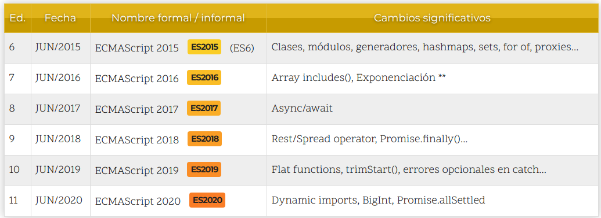

<h2 class="r-fit-text" style="text-align: center"> Desarrollo Web en Entorno Cliente </h2>

---

---

## Breve Introducción

## Historia de JavaScript

- \+ A principios de los años 90, la mayoría de usuarios que se conectaban a Internet lo hacían con módems a una velocidad máxima de 28.8 kbps.  <!-- \+ .element: class="fragment" -->

- \+ Se empiezan a desarrollarse las primeras aplicaciones web (formularios)  <!-- \+ .element: class="fragment" -->

Note:

Con unas aplicaciones web cada vez más complejas y una velocidad de navegación tan lenta, surgió la necesidad de un lenguaje de programación que se ejecutara en el navegador del usuario. De esta forma, si el usuario no rellenaba correctamente un formulario, no se le hacía esperar mucho tiempo hasta que el servidor volviera a mostrar el formulario indicando los errores existentes

##

- \+ Brendan Eich => LiveScript para Netscape Navigator 2.0.  <!-- \+ .element: class="fragment" -->

- \+ Justo antes del lanzamiento Netscape decidió cambiar el nombre por el de JavaScript.  <!-- \+ .element: class="fragment" -->

Note:

- \+ Brendan Eich, un programador que trabajaba en Netscape, pensó que podría solucionar este problema adaptando otras tecnologías existentes (como ScriptEase) al navegador Netscape Navigator 2.0, que iba a lanzarse en 1995. Inicialmente, Eich denominó a su lenguaje LiveScript.

- \+ Justo antes del lanzamiento Netscape decidió cambiar el nombre por el de JavaScript. La razón del cambio de nombre fue exclusivamente por marketing, ya que Java era la palabra de moda en el mundo informático y de Internet de la época.

- \+ Produjo confusión, dando la impresión de que el lenguaje es una prolongación de Java. Fué solo una estrategia de Netscape para obtener prestigio e innovar en lo que eran los nuevos lenguajes de programación web.

##

- \+ La primera versión de JavaScript fue un completo éxito.  <!-- \+ .element: class="fragment" -->

- \+ Microsoft lanzó JScript con su navegador Internet Explorer 3.  <!-- \+ .element: class="fragment" -->

- \+ Netscape decidió que lo mejor sería estandarizar el lenguaje JavaScript.  <!-- \+ .element: class="fragment" -->

- \+ El primer estándar que creó el comité TC39 se denominó ECMA-262, en el que se definió por primera vez el lenguaje ECMAScript.  <!-- \+ .element: class="fragment" -->

Note:

- \+ La primera versión de JavaScript fue un completo éxito y Netscape Navigator 3.0 ya incorporaba la siguiente versión del lenguaje, la versión 1.1.

- \+ Al mismo tiempo, Microsoft lanzó JScript con su navegador Internet Explorer 3. JScript era una copia de JavaScript al que le cambiaron el nombre para evitar problemas legales.

- \+ Para evitar una guerra de tecnologías, Netscape decidió que lo mejor sería estandarizar el lenguaje JavaScript. De esta forma, en 1997 se envió la especificación JavaScript 1.1 al organismo ECMA (European Computer Manufacturers Association).

- \+ ECMA creó el comité TC39 con el objetivo de "estandarizar de un lenguaje de script multiplataforma e independiente de cualquier empresa". El primer estándar que creó el comité TC39 se denominó ECMA-262, en el que se definió por primera vez el lenguaje ECMAScript.

---

## Versiones de ECMAScript

Note:

La lista de versiones de ECMAScript aparecidas hasta el momento son las siguientes, donde encontramos las versiones enmarcadas en lo que podemos considerar el pasado de Javascript.

##

Note:

A partir del año 2015, se marcó un antes y un después en el mundo de Javascript, estableciendo una serie de cambios que lo transformaría en un lenguaje moderno, partiendo desde la especificación de dicho año, hasta la actualidad:

---

## Caraterísticas de JavaScript

- \+ Fue diseñado para dotar de comportamiento dinámico a las páginas web.  <!-- \+ .element: class="fragment" -->

- \+ Es un lenguaje de scripting.  <!-- \+ .element: class="fragment" -->

- \+ Es un lenguaje interpretado (significa que los scripts se ejecutan sin compilación previa).  <!-- \+ .element: class="fragment" -->

- \+ Está tipado dinámicamente.  <!-- \+ .element: class="fragment" -->

Note:
No es necesario declarar el tipo de una variable. El tipo de una variable puede cambiar con el tiempo.

##

- \+ Su sintaxis se asemeja a la de C++ y Java.  <!-- \+ .element: class="fragment" -->

- \+ Está basado en el concepto de objeto, pero no es un lenguaje orientado a objetos.  <!-- \+ .element: class="fragment" -->

Note:

Sus objetos utilizan herencia basada en prototipos -- los objetos no son creados mediante la instanciación de clases sino mediante la clonación de otros objetos o mediante la escritura de código por parte del programador. De esta forma los objetos ya existentes pueden servir de prototipos para los que el programador necesite crear.

---

##

---

##

## ¿Dudas?

