<h2 class="r-fit-text" style="text-align: center"> Desarrollo Web en Entorno Cliente </h2>

---

---

## Breve introducción

---

## ¿Que dice Vue.js sobre sus características?
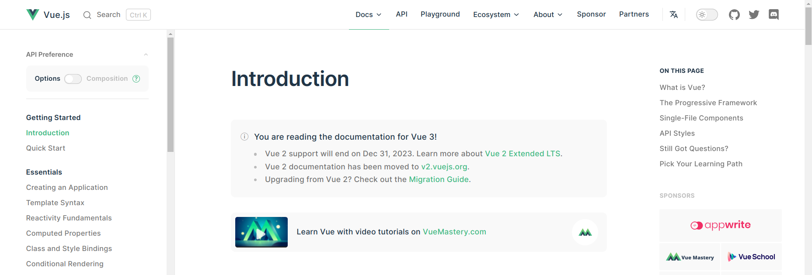

[Vue doc](https://vuejs.org/) 

## Fácil de iniciarse en el
> Si ya conoces HTML, CSS, y Js

## Versatil
> Ecosistema escalable

## Rendimiento

> DOM virtual muy rápido

---

## ¿Fácil de iniciar?

## 

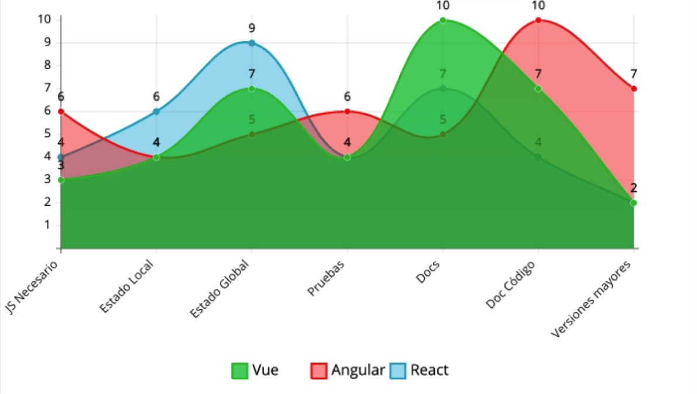

---

## The Progressive Javascript Framework

##

##

##

## The Progressive Javascript Framework
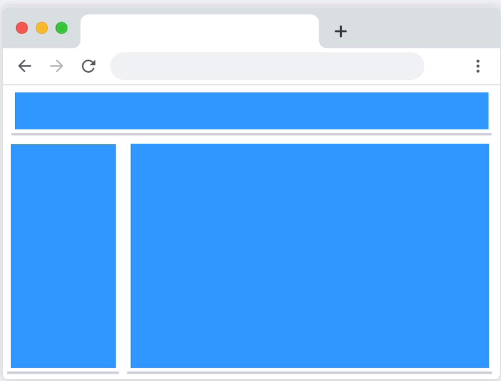

##

## The Progressive Javascript Framework
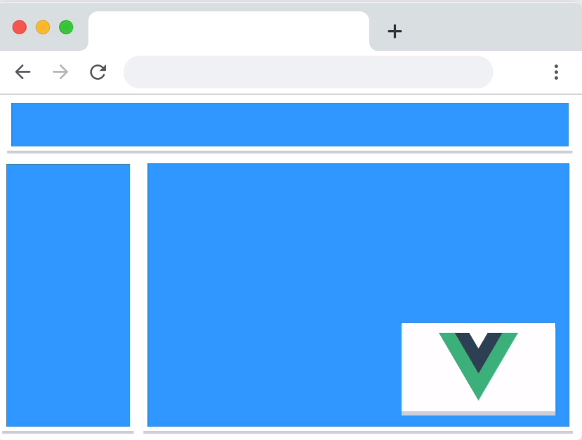

## The Progressive Javascript Framework
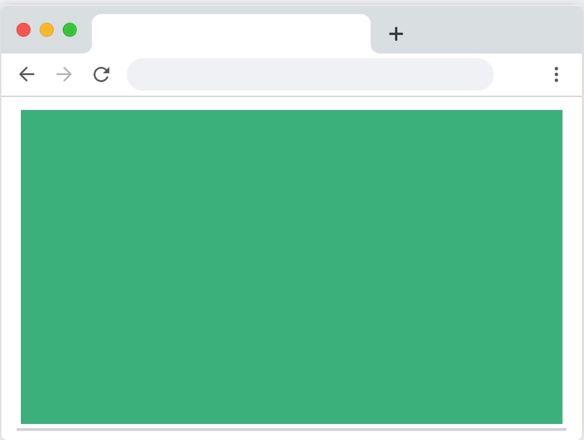

---

## What is the Most Loved Web Framework?

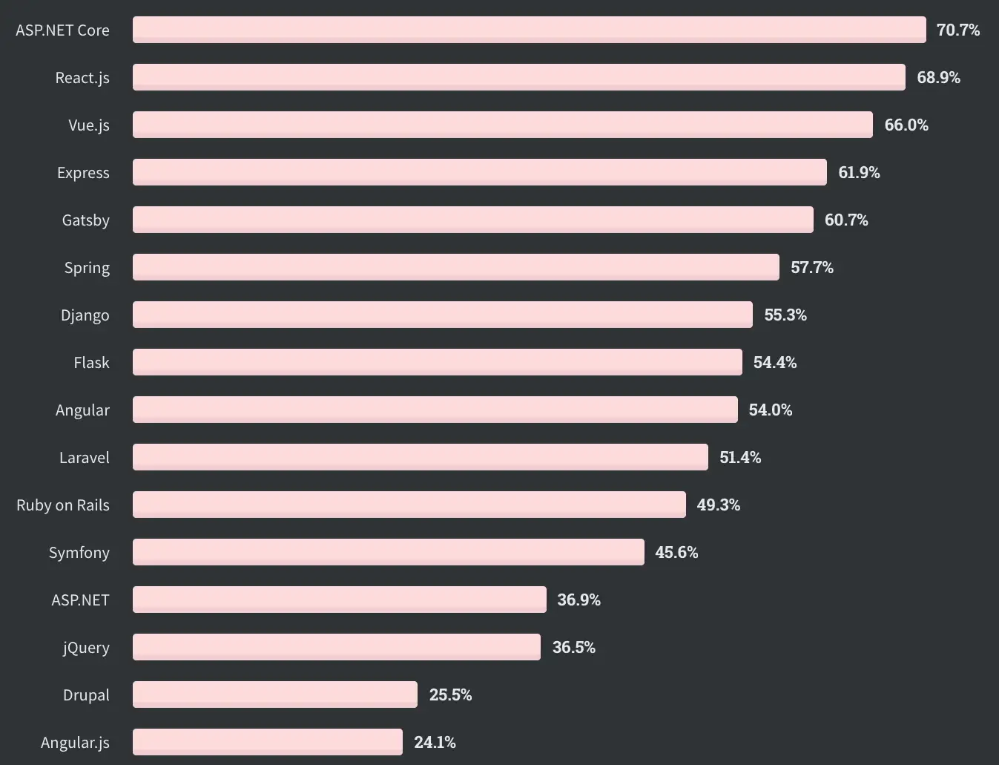

[Fuente: https://medium.com/](https://medium.com/notonlycss/google-apple-and-other-users-of-vue-js-e4505359e5d5) 

---

## Some of the largest companies that have trusted Vue.js

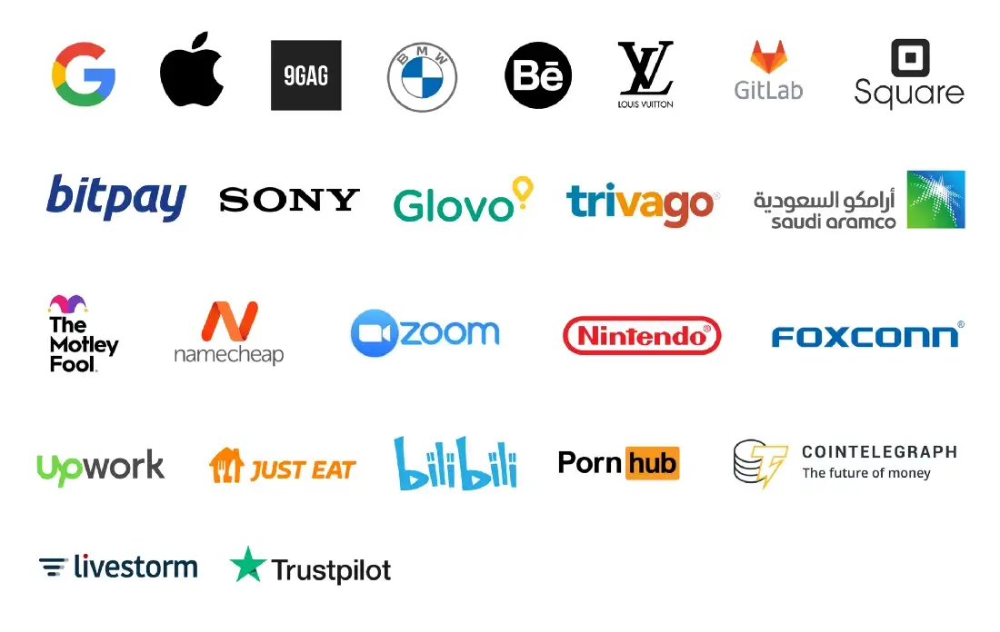

[Fuente: Stackoverflow surveys](https://insights.stackoverflow.com/survey/2020#technology-most-loved-dreaded-and-wanted-web-frameworks-loved2) 

---

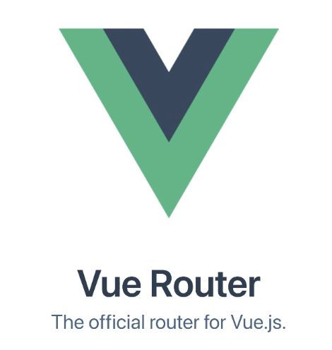

##

##

## Navegación tradicional
### Full Page Refresh

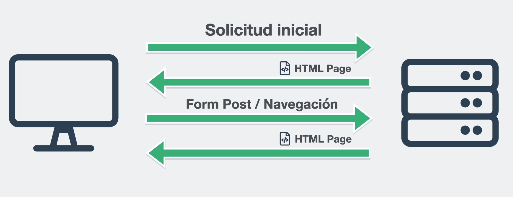

##

## SPA
### Single Page Application

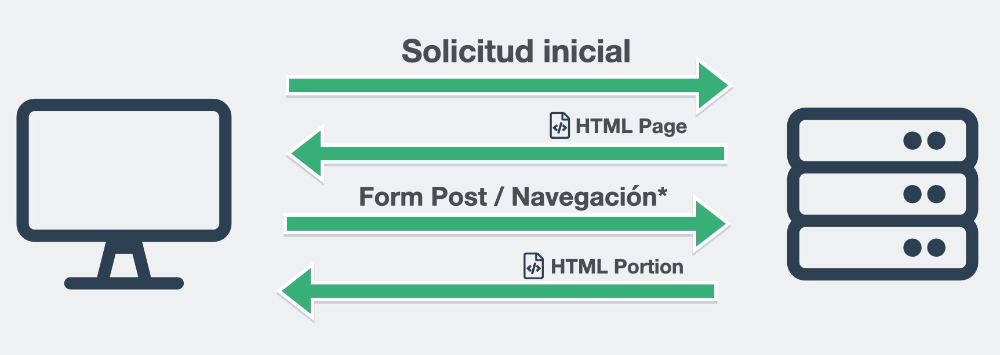

##

## Ventajas SPA
* Tras la carga inicial, experiencia fluida y rápida
* Menos "estrés" para el servidor
* La caché puede reducir peticiones
* Mejor experiencia de usuario
* Carga independiente de módulos, si es necesario.

##

## Desventajas SPA
* Complica la implementación SEO
* Pequeños cambios pueden requerir de un renderizado completo
* Carga inicial pesada (depende de la implementación)

---

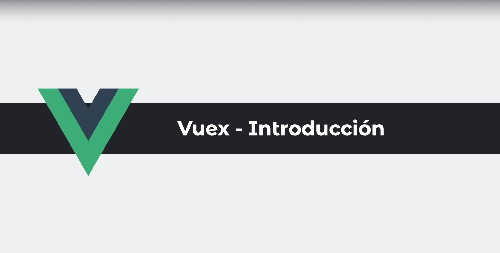

##

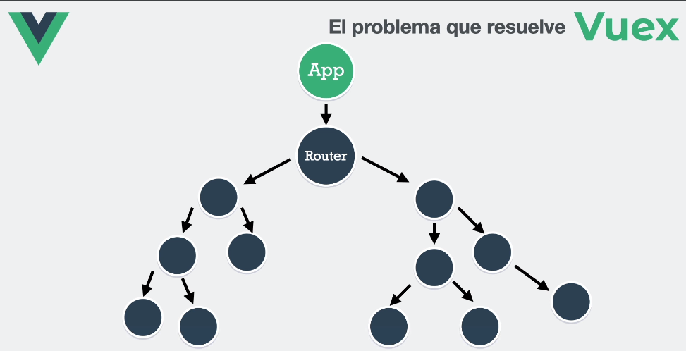

##

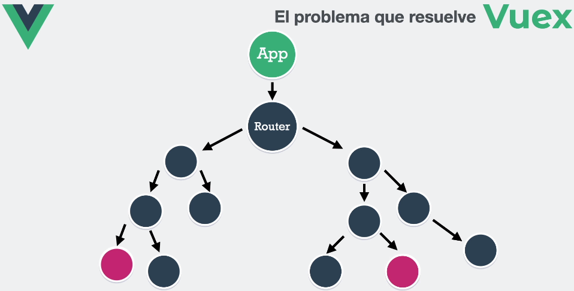

##

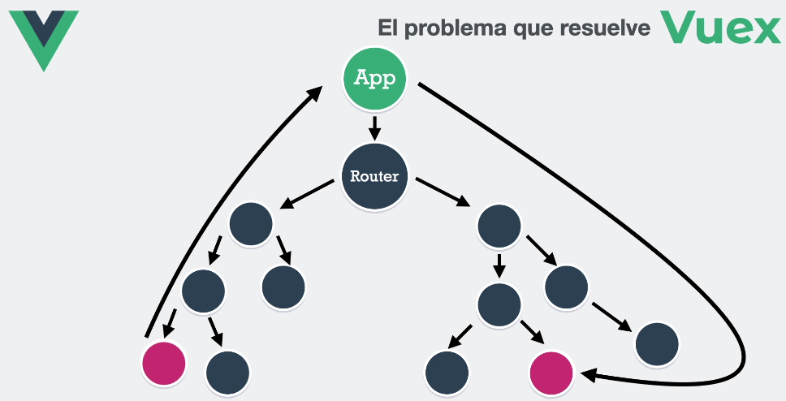

##

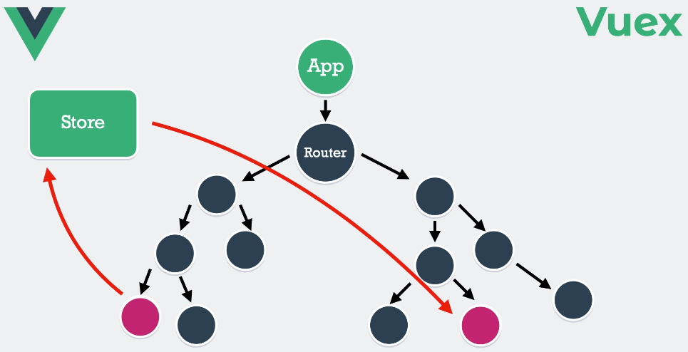

##

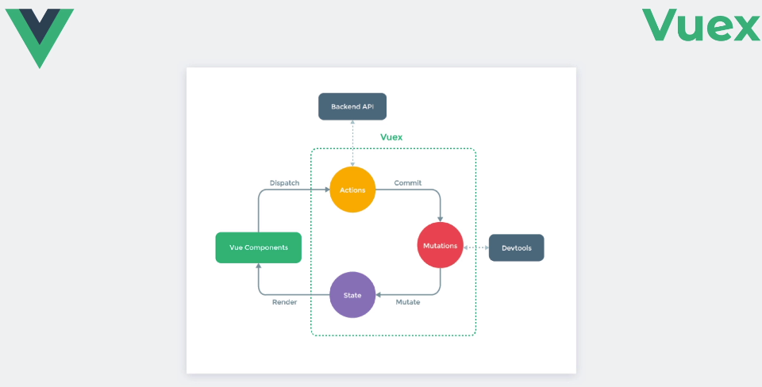

##

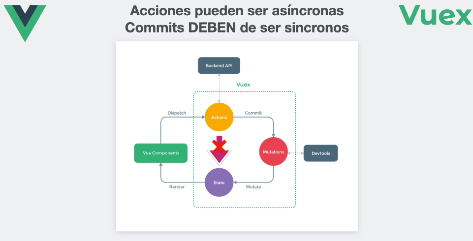

##

## Algunos conceptos
* State: Similar a data(), es reactivo
* Getters: Similar a las propiedades computadas.
* Mutations: Funciones que pueden modificar el state.
* Actions: Funciones que pueden ser asíncronas y pueden llamar mutations.
* Modules: Agrupador de states, getters, mutations, actions y otros modules.

##

## ¿Cuando usar Vuex?

* Vuex nos ayuda a lidiar con con la gestión del estado compartida a costa de una mayor estructura y archivos.
* Tamaño de la aplicación.
* Productividad a corto y largo plazo.

---

## 

## ¿Dudas?

